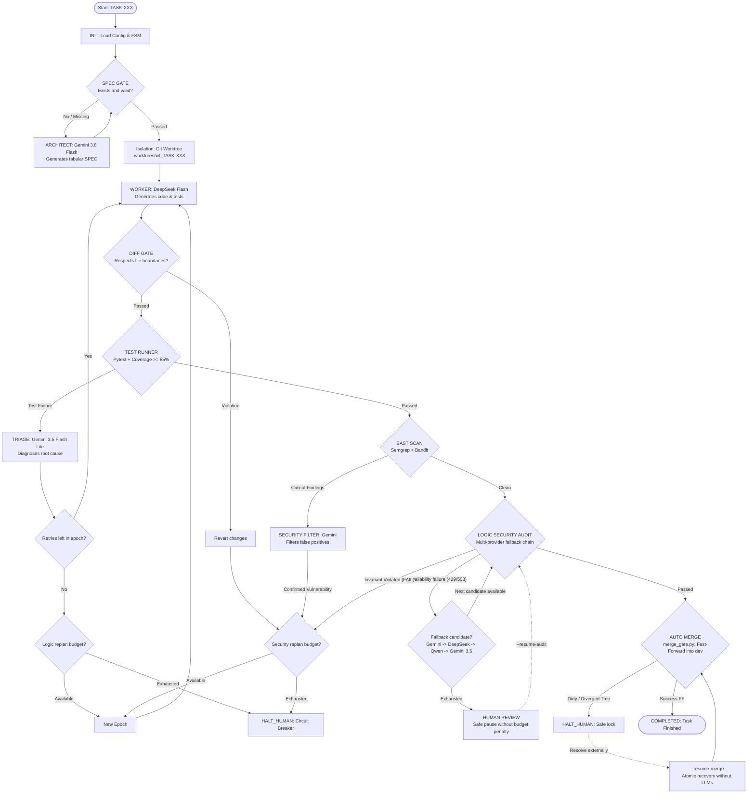

# Autonomous Multi-Agent Software Factory

English | [Español](README_ES.md)

> **Autonomous Multi-Agent Software Development System governed by Finite State Machines (FSM), Deterministic Verification Gates, Execution Budgets, and Git Worktree Isolation.**

[](https://github.com/LE0ST/autonomous-multi-agent-software-factory/actions/workflows/ci.yml)
[](https://www.python.org/downloads/)
[](https://opensource.org/licenses/MIT)
[](https://github.com/psf/black)

---

> [!WARNING]
> **Experimental Project Notice:**
> This is a research and portfolio project focused on execution control, safety invariants, and governance for autonomous coding agents. It is not designed for unmonitored production use and enforces strict execution budgets to prevent infinite loops and runaway API costs.

---

## 1. Problem Statement

Most contemporary multi-agent coding systems encounter critical failure modes when operating on real-world software projects:

* **Unchecked Hallucinations:** Over-reliance on LLM self-evaluations and optimistic "looks good to me" feedback loops.
* **Scope Creep & Code Boundary Violations:** Agents that arbitrarily modify configuration files, delete existing tests to force pass rates, or edit modules outside their assigned scope.
* **Infinite Trial-and-Error Loops:** Unbounded token consumption as agents cycle through repetitive debugging attempts without formal termination budgets.
* **Working Tree Corruption:** Direct modifications made to the active development branch that leave the repository broken when a build or test fails mid-flight.
* **Unsafe Git Integrations:** Non-atomic merges or silent merge conflicts integrated directly into branches without clean-state validation.

### The Solution: Deterministically Governed Factory

**Autonomous Multi-Agent Software Factory** decouples generation from governance. **LLMs are strictly restricted to proposing code, specifications, and diagnostics**, while **workflow control, test execution, security analysis, file boundaries, and Git integration are enforced by non-probabilistic deterministic gates** and a persistent Finite State Machine (FSM).

---

## 2. Architecture and Pipeline Flow



---

## 3. Agent Roles and Models

| Role | Default Model | Provider | Responsibility |
| :--- | :--- | :--- | :--- |
| **Architect** | `gemini-3.8-flash` | Google Gemini | Analyzes requirements and drafts formal tabular specifications (`specs/TASK-XXX.md`). |
| **Worker** | `deepseek-flash` | DeepSeek | Implements source code and unit tests inside an isolated worktree under `RULES.md`. |
| **Triage** | `gemini-3.5-flash-lite` | Google Gemini | Analyzes test failures (`stdout`, `stderr`, stack traces) and outputs structured diagnosis. |
| **Security Filter** | `gemini-3.5-flash-lite` | Google Gemini | Reviews raw SAST alerts to differentiate true positives from false alarms. |
| **Logic Security Auditor** | `gemini-3.8-flash` (Primary)<br/>*Fallbacks:* `deepseek-flash`, `qwen3.8-flash`, `gemini-3.6-flash` (plus `glm-5.3` support) | Google Gemini, DeepSeek, Qwen / DashScope, Zhipu GLM | Verifies that semantic code diffs satisfy all security invariants (`SEC-XX`) under a deterministic, fail-closed multi-provider fallback policy. |

---

## 4. The Six Deterministic Verification Gates

1. **`SPEC_GATE` ([`scripts/spec_gate.py`](scripts/spec_gate.py)):**
   Validates required sections, unambiguous Acceptance Criteria (`[AC-xx]`), Security Invariants (`[SEC-xx]`), and 1:1 traceability in the Test Matrix before any code is written.
2. **`DIFF_GATE` ([`scripts/diff_gate.py`](scripts/diff_gate.py)):**
   Inspects `git diff base...HEAD` inside the worktree. Strictly enforces:
   - `modified_files ⊆ allowed_files`
   - `forbidden_files ∩ modified_files = ∅`
   Blocks edits to root infrastructure files (`pyproject.toml`, `.env*`, `RULES.md`, `orchestrator/`, `scripts/`).
3. **`TEST_RUNNER` ([`scripts/test_runner.py`](scripts/test_runner.py)):**
   Executes `pytest` with coverage measurement. Demands $\ge 85\%$ line coverage on task files. Fails if assertions fail or coverage is deficient.
4. **`SAST_SCAN` ([`scripts/sast_runner.py`](scripts/sast_runner.py)):**
   Runs static application security testing using **Semgrep** (`p/python`, `p/owasp-top-ten`, `p/cwe-top-25`) and **Bandit** (`-lll -iii`).
5. **`LOGIC_AUDIT` ([`orchestrator.py`](orchestrator.py), [`adapters/`](adapters/)):**
   An independent LLM auditor verifies that the semantic Git diff strictly satisfies all stated security invariants (`[SEC-xx]`). Protected by a deterministic multi-provider fallback chain (`gemini-3.8-flash` $\to$ `deepseek-flash` $\to$ `qwen3.8-flash` $\to$ `gemini-3.6-flash`) activating strictly on provider availability failures (HTTP 429/503), strictly rejecting model shopping on semantic `FAIL`.
6. **`MERGE_GATE` ([`scripts/merge_gate.py`](scripts/merge_gate.py)):**
   Verifies that the target repository is clean (`git status --porcelain`) and that the task branch is an ancestor-compatible fast-forward merge target. Enforces `git merge --ff-only` exclusively.

---

## 5. State Machine (FSM), Budgets, and Circuit Breakers

Task lifecycle is managed by [`orchestrator/state_manager.py`](orchestrator/state_manager.py), which persists state into `orchestrator/state/state_<TASK_ID>.json`:

### Formal FSM States
```text
INIT -> SPEC_DESIGN -> SPEC_GATE -> BUILDING -> DIFF_GATE -> TESTING ->
TRIAGING -> SAST_SCAN -> SAST_FILTER -> LOGIC_AUDIT -> AUTO_MERGE
```
Terminal / suspension states: `COMPLETED`, `HALT_HUMAN`, `HUMAN_REVIEW`.

**Deterministic Recovery Pathways:**
* **Merge Recovery (`--resume-merge`):** `HALT_HUMAN` (at `AUTO_MERGE`) $\to$ `AUTO_MERGE` $\to$ `COMPLETED`
* **Audit Recovery (`--resume-audit`):** `HUMAN_REVIEW` (at `LOGIC_AUDIT`) $\to$ `LOGIC_AUDIT` $\to$ `AUTO_MERGE` $\to$ `COMPLETED`

### Execution Budgets
Configured in [`orchestrator/config.json`](orchestrator/config.json):
* `max_worker_per_epoch`: **2** local attempts by Worker per epoch.
* `max_cumulative_worker_runs`: **5** total lifetime Worker runs per task.
* `max_logic_replans`: **2** replanning attempts on persistent test failures.
* `max_security_replans`: **1** replanning attempt on confirmed vulnerabilities.
* `max_spec_syntax_retries`: **1** retry for specification syntax formatting.

### Deterministic Multi-Provider Fallback for LOGIC_AUDIT
To ensure maximum availability against upstream API rate limits (HTTP 429) and transport outages (HTTP 502/503/504) without sacrificing security guarantees, `LOGIC_AUDIT` enforces a deterministic, fail-closed multi-provider fallback policy configured in [`orchestrator/config.json`](orchestrator/config.json):

1. **Primary Model:** `gemini` (`gemini-3.8-flash`)
2. **Fallback Candidate 1:** `deepseek` (`deepseek-flash`)
3. **Fallback Candidate 2:** `qwen` (`qwen3.8-flash`) via DashScope OpenAI-compatible API
4. **Fallback Candidate 3:** `gemini` (`gemini-3.6-flash`)
*(Note: Full adapter support is also implemented for Zhipu GLM via `GLMAdapter`).*

**Strict Fallback Semantics:**
* **Availability Failures Only:** Fallback triggers exclusively on transport-level network errors and provider unavailability (HTTP 429 Too Many Requests, HTTP 502/503/504, connection timeouts, socket aborts) after per-provider retries with exponential backoff (`@retry_with_backoff`) are exhausted.
* **Semantic `FAIL` Never Triggers Fallback (No Model Shopping):** If any candidate model successfully connects and evaluates that a security invariant has been violated (`FAIL`), the audit verdict is final. No further fallback models are queried. The failure immediately consumes a security replan budget and routes back to Triage and Worker.
* **Stop at First Verdict:** The pipeline halts at the first model that successfully returns `PASS`.
* **Safe Halt on Ambiguity or Exhaustion:** If a model returns an ambiguous verdict (`UNCERTAIN`) or malformed JSON, execution transitions safely to `HUMAN_REVIEW` without trying subsequent models. If all candidates in the fallback chain fail due to network availability, execution pauses safely in `HUMAN_REVIEW`.
* **Zero Budget Consumption on Fallbacks:** Switching between fallback models due to transport/availability failures does **not** consume Worker attempts, logic replans, or security replans. The epoch counter is untouched.
* **Structured State Ledger:** The model and provider that successfully performed the audit are deterministically recorded under `audit_model_used: {"provider": "<provider>", "model": "<model>"}` in `state_<TASK_ID>.json` without exposing credentials.

### Circuit Breakers and Human Oversight
* **`CRASH_REPORT_<TASK_ID>.md`:** Triggered when any budget is exhausted or an unrecoverable failure occurs. Freezes worktree artifacts for inspection.
* **`HUMAN_REVIEW`:** Triggered when external LLM endpoints return persistent network or rate limit errors (HTTP 429 or 503). Suspends execution in a safe state **without spending Worker attempts or replan budgets**.
* **`--resume-merge`:** Safe recovery pathway for tasks that cleared every verification gate but halted at `AUTO_MERGE` (e.g., due to local uncommitted edits on `dev`). Performs a clean fast-forward merge without invoking agents, LLMs, or altering budget counters.
* **`--resume-audit`:** Safe recovery pathway for tasks suspended in `HUMAN_REVIEW` with `blocked_reason.gate == LOGIC_AUDIT` (e.g., following upstream HTTP 429 rate limits). Resumes exclusively the pending Logic Security LLM audit without re-running Worker, pytest, SAST, or consuming Worker attempts/replans. If the audit passes, proceeds cleanly towards `AUTO_MERGE`. Enforces Git fast-forward ancestor checks before execution and strictly avoids automatic rebases, preserving worktree integrity if branch divergence occurs.

---

## 6. Git Worktree Isolation

Rather than performing file operations in the main working tree:
* Each task generates an isolated Git worktree at `.worktrees/wt_<TASK_ID>` linked to branch `task/<TASK_ID>`.
* If a Worker introduces broken code, unformatted files, or gate violations, the main branch remains clean and untouched.
* Only when all six gates report `PASS` is the worktree removed and the task branch fast-forward merged into `dev`.

---

## 7. Security Model

* **Least Authority:** Workers can only touch files explicitly designated under `Allowed files` in the task specification.
* **Protected Root Patterns:** Infrastructure files (`pyproject.toml`, `.env*`, `RULES.md`, `orchestrator/**`, `scripts/**`) cannot be modified by Workers.
* **Credential Hygiene:** API keys are never passed as CLI arguments, logged to disk, or committed to Git. The `.gitignore` explicitly filters credentials, virtual environments, worktrees, and dynamic state.
* **Deterministic SAST:** Security scanning occurs locally before code integration.

---

## 8. Installation and Setup

### Prerequisites
* **Python:** `>= 3.10`
* **Git:** `>= 2.30`
* **Semgrep:** `>= 1.0.0`
* Tested on Windows (PowerShell) and Linux / macOS.

### Installation

```bash
# 1. Clone the repository
git clone https://github.com/LE0ST/autonomous-multi-agent-software-factory.git
cd autonomous-multi-agent-software-factory

# 2. Create and activate a virtual environment
python -m venv .venv
# On Windows PowerShell:
.venv\Scripts\Activate.ps1
# On Linux / macOS:
# source .venv/bin/activate

# 3. Install dependencies and the package in editable mode
pip install -e .
```

### Credential Configuration
Copy `.env.example` to `.env`:
```bash
cp .env.example .env
```
Add your API keys to `.env`:
```ini
GEMINI_API_KEY=your-gemini-api-key
DEEPSEEK_API_KEY=your-deepseek-api-key
GLM_API_KEY=your-glm-api-key              # Optional for Zhipu GLM
DASHSCOPE_API_KEY=your-dashscope-api-key  # Optional for Qwen fallback (qwen3.8-flash)
```

---

## 9. Quick Start & Task Execution Workflow

### Safe Task Execution Workflow (Step-by-Step)

Executing a task safely within the factory requires adherence to clean-state invariants:

1. **Always Work from `dev`:**
   Switch to `dev` and ensure your local branch is strictly up-to-date with remote upstream:
   ```bash
   git checkout dev
   git pull --ff-only origin dev
   ```

2. **Define the Specification Contract:**
   Create a new specification file (e.g. `specs/TASK-004.md`) adhering strictly to [`specs/TEMPLATE.md`](specs/TEMPLATE.md). Define unambiguous Acceptance Criteria (`[AC-xx]`), Security Invariants (`[SEC-xx]`), explicit file boundary whitelists (`Allowed files` / `Forbidden files`), and the complete Test Matrix.

3. **Stage and Commit the Specification Before Pipeline Execution:**
   > [!IMPORTANT]
   > **Pre-Execution Invariant:** You must stage and commit the specification contract before launching `orchestrator.py`. Ensure that `git status --short` returns a completely clean working tree. The final merge gate (`merge_gate.py`) verifies working tree cleanliness via `git status --porcelain` and will reject integration if untracked or modified files are detected in the repository root.
   ```bash
   git add specs/TASK-004.md
   git commit -m "spec: add TASK-004 contract"
   git status --short  # Must be completely empty
   ```

4. **Execute the Orchestrator:**
   ```bash
   python orchestrator.py TASK-004
   ```
   **Deterministic Pipeline Progression:**
   * **`SPEC_GATE`:** Validates markdown structure, required sections, AC/SEC traceability, and file boundary declarations.
   * **`BUILDING`:** Allocates an isolated Git worktree (`.worktrees/wt_TASK-004`) on branch `task/TASK-004`. The Worker generates source code and unit tests governed by `RULES.md`.
   * **`DIFF_GATE`:** Enforces set-theoretic file boundaries (`modified_files ⊆ allowed_files` and `forbidden_files ∩ modified_files = ∅`).
   * **`TESTING`:** Executes `pytest` with code coverage enforcement ($\ge 85\%$). Test failures trigger automated diagnosis via Triage and epoch retry loops.
   * **`SAST_SCAN`:** Scans generated code with Semgrep and Bandit; findings are filtered by Security Filter to eliminate false positives.
   * **`LOGIC_AUDIT`:** An independent LLM auditor verifies that the semantic Git diff strictly satisfies all stated security invariants.
   * **`AUTO_MERGE`:** `merge_gate.py` verifies main repository cleanliness and performs an atomic fast-forward merge into `dev` (`git merge --ff-only`).

5. **Verify the Integration Outcome:**
   After pipeline execution finishes, verify system health:
   ```bash
   python -m pytest -v tests/
   git status --short
   git log --oneline --decorate -5
   ```

---

### Copy-Pasteable Workflow Example

```bash
git checkout dev
git pull --ff-only origin dev

# Create specs/TASK-004.md from specs/TEMPLATE.md

git add specs/TASK-004.md
git commit -m "spec: add TASK-004 contract"
git status --short

python orchestrator.py TASK-004

python -m pytest -v tests/
git status --short
git log --oneline --decorate -5
```

---

### Deterministic Merge Recovery (`--resume-merge`)

If an authorized task successfully passes all verification gates (`SPEC_GATE`, `DIFF_GATE`, `TESTING`, `SAST_SCAN`, `LOGIC_AUDIT`) but stops specifically during `AUTO_MERGE` (e.g., due to local uncommitted modifications or working tree dirt in the main repository):

```bash
python orchestrator.py --resume-merge TASK-XXX
```

> [!NOTE]
> **Strict Operational Boundary of `--resume-merge`:**
> * `--resume-merge` is **strictly a recovery mechanism** for tasks authorized at `AUTO_MERGE`.
> * It **never** re-runs Worker, pytest, SAST, Triage, or Logic Security agents.
> * It **never** consumes Worker attempts or replan budgets (`worker_attempts_in_epoch` and `total_cumulative_worker_runs` remain untouched).
> * It is **not** a generic resolution for arbitrary `HALT_HUMAN` states (e.g., failing unit tests or security rejections cannot be bypassed with `--resume-merge`).
> * It validates that the task branch exists, the main tree is clean, and ancestor relationships hold, executing only `git merge --ff-only`.

---

### Deterministic Audit Recovery (`--resume-audit`)

If an authorized task successfully passes all upstream verification gates (`SPEC_GATE`, `DIFF_GATE`, `TESTING`, `SAST_SCAN`) but pauses in `HUMAN_REVIEW` at `LOGIC_AUDIT` due to transient upstream API rate limits or network unavailability (e.g., HTTP 429 Too Many Requests or 503 Service Unavailable):

```bash
python orchestrator.py --resume-audit TASK-XXX
```

> [!NOTE]
> **Strict Operational Boundary of `--resume-audit`:**
> * `--resume-audit` is **strictly authorized** only for tasks suspended in `HUMAN_REVIEW` where `blocked_reason.gate == "LOGIC_AUDIT"` and a historical `LOGIC_AUDIT -> HUMAN_REVIEW` transition is verified in the state ledger.
> * It **never** re-executes Worker, Architect, Triage, `SPEC_GATE`, `DIFF_GATE`, `TESTING` (pytest), or `SAST_SCAN`.
> * It **never** consumes Worker attempts or replan budgets (`worker_attempts_in_epoch`, `logic_replans`, `security_replans` remain untouched).
> * It retries **exclusively** the pending Logic Security LLM audit against the preserved worktree.
> * If upstream rate limits (HTTP 429 / 503) persist, it safely transitions back to `HUMAN_REVIEW` without penalty.
> * If the audit passes and fast-forward conditions are met, it removes the worktree and executes `AUTO_MERGE` into `dev`.
> * If Git divergence is detected (i.e., `dev` received independent commits and is no longer an ancestor of `task/<task_id>`), it **strictly denies recovery and does not perform automatic rebase**, preserving the worktree intact for manual reconciliation.

---

### Troubleshooting & Common Pitfalls

#### Untracked Spec File Aborts `AUTO_MERGE` (TASK-003 Case Study)
* **Symptom:** During task execution, all verification gates pass, but the pipeline halts at the final integration step with `HALT_HUMAN`:
  ```text
  [MERGE_GATE] Main repository has uncommitted modifications. Merge aborted.
  ```
* **Root Cause:** Creating `specs/TASK-XXX.md` without committing it leaves the file untracked (`?? specs/TASK-XXX.md`). The orchestrator isolates code generation inside `.worktrees/wt_TASK-XXX`, but when `AUTO_MERGE` attempts to fast-forward merge `task/TASK-XXX` back into `dev`, `merge_gate.py` detects a dirty main repository.
* **Preventative Solution:** Always stage and commit `specs/TASK-XXX.md` **before** executing `orchestrator.py` (`git add specs/... && git commit -m "spec: ..."`).
* **Recovery Solution:** If caught in this state:
  1. Commit the untracked specification file:
     ```bash
     git add specs/TASK-XXX.md
     git commit -m "spec: add TASK-XXX contract"
     git status --short  # Ensure clean
     ```
  2. Execute atomic merge recovery without re-running agents or consuming tokens:
     ```bash
     python orchestrator.py --resume-merge TASK-XXX
     ```

---

### Additional Operational Modes

#### Dry-Run / Simulation Mode
Validates gates, branching, and worktree logic without spending API tokens:
```bash
python orchestrator.py TASK-001 --simulate
```

#### Run the Test Suite
```bash
python -m pytest -v tests/
```
The complete test suite (202 unit and integration tests) runs locally without requiring external network access or API credentials.

---

## 10. Case Studies: `TASK-001`, `TASK-002`, `TASK-003`, `TASK-004`, and `TASK-005`

The repository contains the complete development and verification history for five integrated production tasks:

1. **`TASK-001` — Token Validator (`src/auth/token_validator.py`):**
   * **Specification:** [`specs/TASK-001.md`](specs/TASK-001.md) defined token verification using constant-time digest comparison (`hmac.compare_digest`), rejecting empty or invalid inputs.
   * **Worker:** Generated the implementation and unit tests in [`tests/test_token_validator.py`](tests/test_token_validator.py).
   * **Gates:** Passed all six deterministic gates and fast-forward merged into `dev`.

2. **`TASK-002` — Secure Password Validator (`src/auth/password_validator.py`):**
   * **Specification:** [`specs/TASK-002.md`](specs/TASK-002.md) defined formal acceptance criteria `[AC-01]` and `[AC-02]` (minimum length of 8 characters, non-empty, requiring at least one letter and at least one digit) and security invariants `[SEC-01]` and `[SEC-02]` (passwords must never be written to disk, logged, printed to stdout/stderr, or hardcoded).
   * **Worker:** Generated the pure helper function `validate_password(password: str) -> bool` and 24 unit tests in [`tests/test_password_validator.py`](tests/test_password_validator.py).
   * **Gates:** Passed `SPEC_GATE`, `DIFF_GATE`, `TESTING` (100% code coverage), `SAST_SCAN`, and `LOGIC_AUDIT`.
   * **Recovery:** Successfully integrated into `dev` using `--resume-merge` after resolving divergence, verifiable in the Git commit history.

3. **`TASK-003` — In-Memory Rate Limiter (`src/security/rate_limiter.py`):**
   * **Specification:** [`specs/TASK-003.md`](specs/TASK-003.md) defined a configurable time-window rate limiter class `RateLimiter` (`allow(client_id, now)`) with acceptance criteria `[AC-01]` through `[AC-05]` and strict security invariants `[SEC-01]` through `[SEC-03]` (no I/O, no logging of client IDs, no external persistence, encapsulated instance state).
   * **Worker:** Generated `RateLimiter` and comprehensive unit tests in [`tests/test_rate_limiter.py`](tests/test_rate_limiter.py).
   * **Gates & Integration:** Passed all verification gates (`SPEC_GATE`, `DIFF_GATE`, `TESTING`, `SAST_SCAN`, `LOGIC_AUDIT`), initially halted at `AUTO_MERGE` with `HALT_HUMAN` because of an untracked specification file in the main working tree, and was subsequently integrated into `dev` after resolving repository cleanliness.

4. **`TASK-004` — Thread-Safe In-Memory TTL/LRU Cache (`src/cache/ttl_cache.py`):**
   * **Specification:** [`specs/TASK-004.md`](specs/TASK-004.md) defined a concurrent `TTLCache` with configurable capacity (`max_size`) and default expiration (`default_ttl`), `set`, `get`, `delete`, `clear`, LRU eviction for active entries, strict thread safety under concurrent operations (`[AC-01]` through `[AC-10]`), and security invariants (`[SEC-01]` through `[SEC-04]`).
   * **Worker Attempt 1 & Triage:** In Epoch 1, Worker attempt 1 generated initial code and tests. During `TESTING`, concurrent execution tests failed due to a race condition. The deterministic `TESTING` gate caught the failure and invoked **Triage**, which inspected the execution traceback and diagnosed the exact concurrency root cause.
   * **Worker Attempt 2:** Guided by the structured Triage diagnosis, Worker attempt 2 corrected the concurrency handling and internal locking.
   * **Gates & Suspension:** Attempt 2 passed `DIFF_GATE`, `TESTING` (100% code coverage across 19 unit tests in [`tests/test_ttl_cache.py`](tests/test_ttl_cache.py)), and `SAST_SCAN` (zero findings in Semgrep and Bandit). At `LOGIC_AUDIT`, an upstream API rate limit (HTTP 429) was encountered; the pipeline safely transitioned to `HUMAN_REVIEW` without penalizing Worker replan budgets.
   * **Recovery & Integration:** Once the provider rate limit cleared, recovery was executed via `--resume-audit TASK-004`. The audit passed, the worktree was cleanly detached, and the task completed through `AUTO_MERGE -> COMPLETED` via Fast-Forward merge into `dev`.

5. **`TASK-005` — Multi-Tenant Authorization Policy Engine (`src/security/authorization_policy.py`):**
   * **Specification:** [`specs/TASK-005.md`](specs/TASK-005.md) defined a stateless, deny-by-default authorization policy class `AuthorizationPolicy` with `is_allowed(subject_tenant: str, resource_tenant: str, roles: set[str], action: str) -> bool` (`[AC-01]`, `[AC-02]`). Acceptance criteria mandated default deny (`[AC-03]`), strict tenant isolation where access is permitted only when `subject_tenant == resource_tenant` across all roles including `admin` (`[AC-04]`, `[AC-05]`), granular role permissions (`viewer`: `read`; `editor`: `read`, `write`; `admin`: `read`, `write`, `delete`) (`[AC-06]`), and strict denial on unknown roles, unknown actions, or empty role sets (`[AC-07]` through `[AC-10]`). Security invariants mandated total prohibition of cross-tenant access (`[SEC-01]`), fail-closed semantics on missing/malformed/unknown inputs (`[SEC-02]`), zero hidden bypasses or admin tenant overrides (`[SEC-03]`), non-emission of tenant IDs, roles, and decisions to disk/logs/stdout/stderr (`[SEC-04]`), immutable stateless execution with no mutable global state (`[SEC-05]`), and zero dynamic execution (`eval`, `exec`, subprocesses, network, or external persistence) (`[SEC-06]`).
   * **Worker:** In Epoch 1 attempt 1, the Worker implemented `AuthorizationPolicy` in [`src/security/authorization_policy.py`](src/security/authorization_policy.py) and 70 comprehensive unit tests in [`tests/test_authorization_policy.py`](tests/test_authorization_policy.py).
   * **Gates & Suspension:** Passed `SPEC_GATE`, `DIFF_GATE`, `TESTING` (100% code coverage across all 70 unit tests), and `SAST_SCAN` (zero findings in Semgrep and Bandit). At `LOGIC_AUDIT`, an upstream API availability failure occurred (persistent HTTP 503 Service Unavailable). The pipeline safely transitioned to `HUMAN_REVIEW` without consuming Worker attempts or replan budgets.
   * **Reconciliation & Integration:** After resolving Git divergence against `dev` where independent updates had been integrated, recovery was executed via `--resume-audit TASK-005`. The successful final audit was performed by `gemini:gemini-3.8-flash`. The worktree was cleanly detached and fast-forward merged into `dev` (`AUTO_MERGE -> COMPLETED`).

---

## 11. Repository Structure

```text
.
├── .env.example                # Safe credentials template
├── .gitignore                  # Git exclusion rules
├── .semgrepignore              # SAST exclusion rules
├── CONTRIBUTING.md             # Contribution guidelines (English)
├── CONTRIBUTING_ES.md          # Guía de contribución (Español)
├── LICENSE                     # MIT License
├── pyproject.toml              # Packaging metadata and dependencies
├── README.md                   # Primary English documentation
├── README_ES.md                # Spanish documentation
├── RULES.md                    # Worker governance directives
│
├── .github/workflows/          # Continuous integration
│   └── ci.yml                  # GitHub Actions test workflow
│
├── adapters/                   # LLM provider adapters
│   ├── contracts.py            # Pydantic v2 structured schemas
│   ├── deepseek_adapter.py     # Worker / code generation
│   ├── gemini_adapter.py       # Architect, Triage, Security Filter, Logic Security
│   ├── glm_adapter.py          # Alternative Logic Security provider
│   ├── network_retry.py        # HTTP resilience with exponential backoff
│   ├── qwen_adapter.py         # DashScope / Qwen Logic Security fallback
│   └── sanitizer.py            # Secret redaction and credential hygiene
│
├── orchestrator/               # Core orchestrator and FSM
│   ├── config.json             # Budgets, roles, and thresholds
│   ├── env_loader.py           # Environment variable loader
│   └── state_manager.py        # Finite State Machine controller
│
├── scripts/                    # Deterministic verification gates
│   ├── diff_gate.py            # File boundary enforcement
│   ├── discovery.py            # Repository structure analysis
│   ├── merge_gate.py           # Atomic fast-forward merge gate
│   ├── sast_runner.py          # Semgrep & Bandit security runner
│   ├── spec_gate.py            # Specification contract validator
│   ├── test_runner.py          # Pytest runner with coverage enforcement
│   └── worktree_manager.py     # Git worktree isolation manager
│
├── specs/                      # Task specifications
│   ├── TASK-001.md             # Token validator specification
│   ├── TASK-002.md             # Secure password validator specification
│   ├── TASK-003.md             # In-memory rate limiter specification
│   ├── TASK-004.md             # Thread-safe TTL/LRU cache specification
│   ├── TASK-005.md             # Multi-tenant authorization policy specification
│   └── TEMPLATE.md             # Canonical specification template
│
├── src/                        # Production code generated and integrated
│   ├── auth/
│   │   ├── password_validator.py
│   │   └── token_validator.py
│   ├── cache/
│   │   └── ttl_cache.py
│   └── security/
│       ├── authorization_policy.py
│       └── rate_limiter.py
│
└── tests/                      # Automated test suite (202 tests)
    ├── test_audit_fallback.py
    ├── test_authorization_policy.py
    ├── test_deepseek_adapter.py
    ├── test_diff_gate.py
    ├── test_e2e_dry_run.py
    ├── test_gemini_adapter.py
    ├── test_network_retry.py
    ├── test_password_validator.py
    ├── test_rate_limiter.py
    ├── test_resume_audit.py
    ├── test_resume_merge.py
    ├── test_sanitizer.py
    ├── test_spec_gate.py
    ├── test_state_manager.py
    ├── test_token_validator.py
    └── test_ttl_cache.py
```

---

## 12. Current Limitations & Roadmap

### Current Limitations
* **Single Language (Python):** SAST scanning and test runner gates are currently tailored for Python repositories.
* **Single Task Sequential Execution:** Tasks are processed sequentially; concurrent multi-task pipelining is in development.
* **Commercial APIs:** Requires commercial API keys (Google Gemini, DeepSeek, or Zhipu GLM) unless running in `--simulate` mode.

### Roadmap
- [ ] Local model support via Ollama / vLLM (zero token cost for Worker and Triage).
- [ ] Polyglot test gate support (Node.js/TypeScript with Vitest, Rust with `cargo test`).
- [ ] Concurrent multi-task scheduling across independent worktrees.
- [ ] Automated specification generation directly from GitHub Issues.
- [ ] Telemetry dashboard visualizing state transitions, token spend, and gate outcomes.

---

## 13. License

Distributed under the **MIT License**. See [`LICENSE`](LICENSE) for details.
