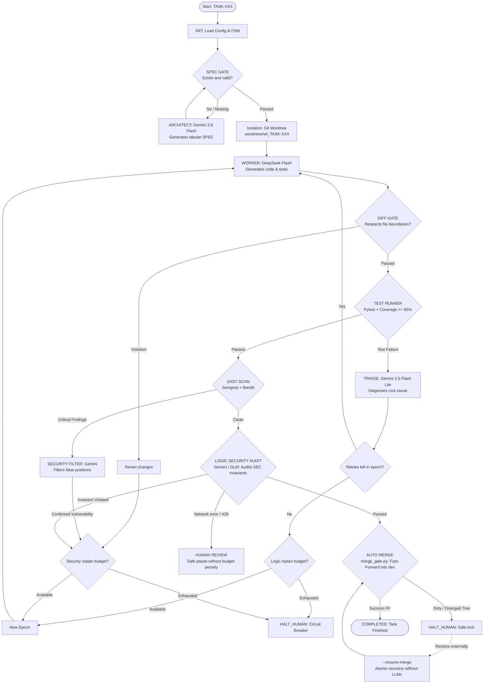

# Autonomous Multi-Agent Software Factory

English | [Español](README_ES.md)

> **Autonomous Multi-Agent Software Development System governed by Finite State Machines (FSM), Deterministic Verification Gates, Execution Budgets, and Git Worktree Isolation.**

[](https://github.com/LE0ST/autonomous-multi-agent-software-factory/actions/workflows/ci.yml)
[](https://www.python.org/downloads/)
[](https://opensource.org/licenses/MIT)
[](https://github.com/psf/black)

---

> [!WARNING]
> **Experimental Project Notice:**
> This is a research and portfolio project focused on execution control, safety invariants, and governance for autonomous coding agents. It is not designed for unmonitored production use and enforces strict execution budgets to prevent infinite loops and runaway API costs.

---

## 1. Problem Statement

Most contemporary multi-agent coding systems encounter critical failure modes when operating on real-world software projects:

* **Unchecked Hallucinations:** Over-reliance on LLM self-evaluations and optimistic "looks good to me" feedback loops.
* **Scope Creep & Code Boundary Violations:** Agents that arbitrarily modify configuration files, delete existing tests to force pass rates, or edit modules outside their assigned scope.
* **Infinite Trial-and-Error Loops:** Unbounded token consumption as agents cycle through repetitive debugging attempts without formal termination budgets.
* **Working Tree Corruption:** Direct modifications made to the active development branch that leave the repository broken when a build or test fails mid-flight.
* **Unsafe Git Integrations:** Non-atomic merges or silent merge conflicts integrated directly into branches without clean-state validation.

### The Solution: Deterministically Governed Factory

**Autonomous Multi-Agent Software Factory** decouples generation from governance. **LLMs are strictly restricted to proposing code, specifications, and diagnostics**, while **workflow control, test execution, security analysis, file boundaries, and Git integration are enforced by non-probabilistic deterministic gates** and a persistent Finite State Machine (FSM).

---

## 2. Architecture and Pipeline Flow



---

## 3. Agent Roles and Models

| Role | Default Model | Provider | Responsibility |
| :--- | :--- | :--- | :--- |
| **Architect** | `gemini-3.8-flash` | Google Gemini | Analyzes requirements and drafts formal tabular specifications (`specs/TASK-XXX.md`). |
| **Worker** | `deepseek-flash` | DeepSeek | Implements source code and unit tests inside an isolated worktree under `RULES.md`. |
| **Triage** | `gemini-3.5-flash-lite` | Google Gemini | Analyzes test failures (`stdout`, `stderr`, stack traces) and outputs structured diagnosis. |
| **Security Filter** | `gemini-3.5-flash-lite` | Google Gemini | Reviews raw SAST alerts to differentiate true positives from false alarms. |
| **Logic Security Auditor** | `gemini-3.8-flash` / `glm-5.3` | Gemini / Zhipu GLM | Verifies that semantic code diffs satisfy all security invariants (`SEC-XX`). |

---

## 4. The Six Deterministic Verification Gates

1. **`SPEC_GATE` ([`scripts/spec_gate.py`](scripts/spec_gate.py)):**
   Validates required sections, unambiguous Acceptance Criteria (`[AC-xx]`), Security Invariants (`[SEC-xx]`), and 1:1 traceability in the Test Matrix before any code is written.
2. **`DIFF_GATE` ([`scripts/diff_gate.py`](scripts/diff_gate.py)):**
   Inspects `git diff base...HEAD` inside the worktree. Strictly enforces:
   - `modified_files ⊆ allowed_files`
   - `forbidden_files ∩ modified_files = ∅`
   Blocks edits to root infrastructure files (`pyproject.toml`, `.env*`, `RULES.md`, `orchestrator/`, `scripts/`).
3. **`TEST_RUNNER` ([`scripts/test_runner.py`](scripts/test_runner.py)):**
   Executes `pytest` with coverage measurement. Demands $\ge 85\%$ line coverage on task files. Fails if assertions fail or coverage is deficient.
4. **`SAST_SCAN` ([`scripts/sast_runner.py`](scripts/sast_runner.py)):**
   Runs static application security testing using **Semgrep** (`p/python`, `p/owasp-top-ten`, `p/cwe-top-25`) and **Bandit** (`-lll -iii`).
5. **`LOGIC_AUDIT` ([`adapters/gemini_adapter.py`](adapters/gemini_adapter.py) / [`adapters/glm_adapter.py`](adapters/glm_adapter.py)):**
   A dedicated model audits the Git diff specifically against the task's stated security invariants.
6. **`MERGE_GATE` ([`scripts/merge_gate.py`](scripts/merge_gate.py)):**
   Verifies that the target repository is clean (`git status --porcelain`) and that the task branch is an ancestor-compatible fast-forward merge target. Enforces `git merge --ff-only` exclusively.

---

## 5. State Machine (FSM), Budgets, and Circuit Breakers

Task lifecycle is managed by [`orchestrator/state_manager.py`](orchestrator/state_manager.py), which persists state into `orchestrator/state/state_<TASK_ID>.json`:

### Formal FSM States
```text
INIT -> SPEC_DESIGN -> SPEC_GATE -> BUILDING -> DIFF_GATE -> TESTING ->
TRIAGING -> SAST_SCAN -> SAST_FILTER -> LOGIC_AUDIT -> AUTO_MERGE
```
Terminal / suspension states: `COMPLETED`, `HALT_HUMAN`, `HUMAN_REVIEW`.

### Execution Budgets
Configured in [`orchestrator/config.json`](orchestrator/config.json):
* `max_worker_per_epoch`: **2** local attempts by Worker per epoch.
* `max_cumulative_worker_runs`: **5** total lifetime Worker runs per task.
* `max_logic_replans`: **2** replanning attempts on persistent test failures.
* `max_security_replans`: **1** replanning attempt on confirmed vulnerabilities.
* `max_spec_syntax_retries`: **1** retry for specification syntax formatting.

### Circuit Breakers and Human Oversight
* **`CRASH_REPORT_<TASK_ID>.md`:** Triggered when any budget is exhausted or an unrecoverable failure occurs. Freezes worktree artifacts for inspection.
* **`HUMAN_REVIEW`:** Triggered when external LLM endpoints return persistent network or rate limit errors (HTTP 429 or 503). Suspends execution in a safe state **without spending Worker attempts or replan budgets**.
* **`--resume-merge`:** Safe recovery pathway for tasks that cleared every verification gate but halted at `AUTO_MERGE` (e.g., due to local uncommitted edits on `dev`). Performs a clean fast-forward merge without invoking agents, LLMs, or altering budget counters.

---

## 6. Git Worktree Isolation

Rather than performing file operations in the main working tree:
* Each task generates an isolated Git worktree at `.worktrees/wt_<TASK_ID>` linked to branch `task/<TASK_ID>`.
* If a Worker introduces broken code, unformatted files, or gate violations, the main branch remains clean and untouched.
* Only when all six gates report `PASS` is the worktree removed and the task branch fast-forward merged into `dev`.

---

## 7. Security Model

* **Least Authority:** Workers can only touch files explicitly designated under `Allowed files` in the task specification.
* **Protected Root Patterns:** Infrastructure files (`pyproject.toml`, `.env*`, `RULES.md`, `orchestrator/**`, `scripts/**`) cannot be modified by Workers.
* **Credential Hygiene:** API keys are never passed as CLI arguments, logged to disk, or committed to Git. The `.gitignore` explicitly filters credentials, virtual environments, worktrees, and dynamic state.
* **Deterministic SAST:** Security scanning occurs locally before code integration.

---

## 8. Installation and Setup

### Prerequisites
* **Python:** `>= 3.10`
* **Git:** `>= 2.30`
* **Semgrep:** `>= 1.0.0`
* Tested on Windows (PowerShell) and Linux / macOS.

### Installation

```bash
# 1. Clone the repository
git clone https://github.com/LE0ST/autonomous-multi-agent-software-factory.git
cd autonomous-multi-agent-software-factory

# 2. Create and activate a virtual environment
python -m venv .venv
# On Windows PowerShell:
.venv\Scripts\Activate.ps1
# On Linux / macOS:
# source .venv/bin/activate

# 3. Install dependencies and the package in editable mode
pip install -e .
```

### Credential Configuration
Copy `.env.example` to `.env`:
```bash
cp .env.example .env
```
Add your API keys to `.env`:
```ini
GEMINI_API_KEY=your-gemini-api-key
DEEPSEEK_API_KEY=your-deepseek-api-key
GLM_API_KEY=your-glm-api-key  # Optional
```

---

## 9. Usage

### Run a Task Pipeline
To execute a task defined in a specification (e.g. `specs/TASK-002.md`):
```bash
python orchestrator.py TASK-002
```

### Dry-Run / Simulation Mode
Validates gates, branching, and worktree logic without spending API tokens:
```bash
python orchestrator.py TASK-001 --simulate
```

### Deterministic Merge Recovery (`--resume-merge`)
If a task previously passed all verification gates but halted during merge due to uncommitted working tree changes:
```bash
python orchestrator.py --resume-merge TASK-002
```

### Run the Test Suite
```bash
python -m pytest tests/
```
Currently, **62 unit and integration tests pass** out-of-the-box without requiring external network access or API credentials.

---

## 10. Case Studies: `TASK-001` and `TASK-002`

The repository contains the complete development and verification history for two integrated production tasks:

1. **`TASK-001` — Token Validator (`src/auth/token_validator.py`):**
   * **Specification:** [`specs/TASK-001.md`](specs/TASK-001.md) defined token verification using constant-time digest comparison (`hmac.compare_digest`), rejecting empty or invalid inputs.
   * **Worker:** Generated the implementation and unit tests in [`tests/test_token_validator.py`](tests/test_token_validator.py).
   * **Gates:** Passed all six deterministic gates and fast-forward merged into `dev`.

2. **`TASK-002` — Secure Password Validator (`src/auth/password_validator.py`):**
   * **Specification:** [`specs/TASK-002.md`](specs/TASK-002.md) defined formal acceptance criteria `[AC-01]` and `[AC-02]` (minimum length of 8 characters, non-empty, requiring at least one letter and at least one digit) and security invariants `[SEC-01]` and `[SEC-02]` (passwords must never be written to disk, logged, printed to stdout/stderr, or hardcoded).
   * **Worker:** Generated the pure helper function `validate_password(password: str) -> bool` and 24 unit tests in [`tests/test_password_validator.py`](tests/test_password_validator.py).
   * **Gates:** Passed `SPEC_GATE`, `DIFF_GATE`, `TESTING` (100% code coverage), `SAST_SCAN`, and `LOGIC_AUDIT`.
   * **Recovery:** Successfully integrated into `dev` using `--resume-merge` after resolving divergence, verifiable in the Git commit history.

---

## 11. Repository Structure

```text
.
├── .env.example                # Safe credentials template
├── .gitignore                  # Git exclusion rules
├── .semgrepignore              # SAST exclusion rules
├── CONTRIBUTING.md             # Contribution guidelines
├── LICENSE                     # MIT License
├── pyproject.toml              # Packaging metadata and dependencies
├── README.md                   # Primary English documentation
├── README_ES.md                # Spanish documentation
├── RULES.md                    # Worker governance directives
│
├── .github/workflows/          # Continuous integration
│   └── ci.yml                  # GitHub Actions test workflow
│
├── adapters/                   # LLM provider adapters
│   ├── contracts.py            # Pydantic v2 structured schemas
│   ├── deepseek_adapter.py     # Worker / code generation
│   ├── gemini_adapter.py       # Architect, Triage, Security Filter, Logic Security
│   ├── glm_adapter.py          # Alternative Logic Security provider
│   └── network_retry.py        # HTTP resilience with exponential backoff
│
├── orchestrator/               # Core orchestrator and FSM
│   ├── config.json             # Budgets, roles, and thresholds
│   ├── env_loader.py           # Environment variable loader
│   └── state_manager.py        # Finite State Machine controller
│
├── scripts/                    # Deterministic verification gates
│   ├── diff_gate.py            # File boundary enforcement
│   ├── discovery.py            # Repository structure analysis
│   ├── merge_gate.py           # Atomic fast-forward merge gate
│   ├── sast_runner.py          # Semgrep & Bandit security runner
│   ├── spec_gate.py            # Specification contract validator
│   ├── test_runner.py          # Pytest runner with coverage enforcement
│   └── worktree_manager.py     # Git worktree isolation manager
│
├── specs/                      # Task specifications
│   ├── TASK-001.md             # Token validator specification
│   ├── TASK-002.md             # Secure password validator specification
│   └── TEMPLATE.md             # Canonical specification template
│
├── src/                        # Production code generated and integrated
│   └── auth/
│       ├── password_validator.py
│       └── token_validator.py
│
└── tests/                      # Automated test suite (62 tests)
    ├── test_deepseek_adapter.py
    ├── test_diff_gate.py
    ├── test_e2e_dry_run.py
    ├── test_network_retry.py
    ├── test_password_validator.py
    ├── test_resume_merge.py
    ├── test_spec_gate.py
    ├── test_state_manager.py
    └── test_token_validator.py
```

---

## 12. Current Limitations & Roadmap

### Current Limitations
* **Single Language (Python):** SAST scanning and test runner gates are currently tailored for Python repositories.
* **Single Task Sequential Execution:** Tasks are processed sequentially; concurrent multi-task pipelining is in development.
* **Commercial APIs:** Requires commercial API keys (Google Gemini, DeepSeek, or Zhipu GLM) unless running in `--simulate` mode.

### Roadmap
- [ ] Local model support via Ollama / vLLM (zero token cost for Worker and Triage).
- [ ] Polyglot test gate support (Node.js/TypeScript with Vitest, Rust with `cargo test`).
- [ ] Concurrent multi-task scheduling across independent worktrees.
- [ ] Automated specification generation directly from GitHub Issues.
- [ ] Telemetry dashboard visualizing state transitions, token spend, and gate outcomes.

---

## 13. License

Distributed under the **MIT License**. See [`LICENSE`](LICENSE) for details.
