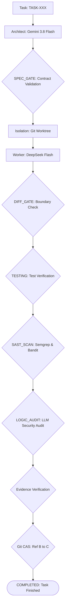

# Autonomous Multi-Agent Software Factory

English | [Español](README_ES.md)

LLM agents propose specifications and software changes. Deterministic controllers govern the finite-state workflow, isolated Git worktrees, execution and test gates, security analysis, evidence, recovery, and Git integration. This repository also contains bounded C++/Windows research for a durable-state security boundary; that fixture is separate from the Python runtime.

**Implemented highlights:** finite-state-machine orchestration · Git worktree isolation · immutable verification context · controller-side behavioral challenges · Semgrep + Bandit · HMAC evidence chaining · atomic Git compare-and-swap (CAS) integration · bounded recovery · adversarial security tests.

**Technologies demonstrated:** Python, C++, Windows API, Git internals, concurrency, finite-state machines, multi-agent systems, LLM APIs, pytest, Semgrep, Bandit, security engineering, threat modeling, CI/CD, cryptographic integrity, deterministic verification.

[](https://github.com/LE0ST/autonomous-multi-agent-software-factory/actions/workflows/ci.yml)
[](https://www.python.org/downloads/)
[](https://opensource.org/licenses/MIT)

---

> [!WARNING]
> **Round 3.7 research checkpoint — not a security milestone.** The earlier public baseline is `c5fd13c`; this curated snapshot presents later research. Current work includes reviewed local S2–S5 repairs and bounded Stage A C++ source, while **S1 remains OPEN, G1 is HOLD / UNAPPROVED, Stage A is NOT PASSED, and Round 3.7 is NOT PASSED**. P14/P15 and process-object ACE designs remain under adjudication. See [Round 3.7 status](#8-independent-security-audit--remediation-status) and the [checkpoint claims matrix](remediation/portfolio_checkpoint_2026_09/SECURITY_CLAIMS_MATRIX.md).

This project uses adversarial review as part of development. Confirmed findings are preserved, converted into frozen regression evidence, remediated in bounded source increments, and independently reviewed before further security claims are made.

**Run locally:** See [installation](#14-installation-and-setup) and [quick start](#15-quick-start--task-execution-workflow). `pytest -q tests/` exercises the Python suite; the [test plan](remediation/portfolio_checkpoint_2026_09/PREPUBLICATION_TEST_PLAN.md) records current checks and environment limits.

---

## 1. Problem Statement

Most contemporary multi-agent coding systems encounter critical failure modes when operating on real-world software projects:

* **Unchecked Hallucinations:** Over-reliance on LLM self-evaluations and optimistic "looks good to me" feedback loops.
* **Scope Creep & Code Boundary Violations:** Agents that arbitrarily modify configuration files, delete existing tests to force pass rates, or edit modules outside their assigned scope.
* **Infinite Trial-and-Error Loops:** Unbounded token consumption as agents cycle through repetitive debugging attempts without formal termination budgets.
* **Working Tree Corruption:** Direct modifications made to the active development branch that leave the repository broken when a build or test fails mid-flight.
* **Unsafe Git Integrations:** Non-atomic merges or silent merge conflicts integrated directly into branches without clean-state validation.

### The Solution: Deterministically Governed Factory

**Autonomous Multi-Agent Software Factory** decouples generation from governance. **LLMs are strictly restricted to proposing code, specifications, and diagnostics**, while **workflow control, test execution, security analysis, file boundaries, and Git integration are enforced by non-probabilistic deterministic gates**, a transactional Finite State Machine (FSM), and cryptographic verification evidence.

---

## 2. Architecture and Pipeline Flow


```mermaid
flowchart TD
    Task["Task: TASK-XXX"] --> Architect["Architect: Gemini 3.8 Flash"]
    Architect --> SPEC_GATE{"SPEC_GATE: Contract Validation"}
    SPEC_GATE --> Worktree["Isolation: Git Worktree"]
    Worktree --> Worker["Worker: DeepSeek Flash"]
    Worker --> DIFF_GATE{"DIFF_GATE: Boundary Check"}
    DIFF_GATE --> TESTING{"TESTING: Test Verification"}
    TESTING --> SAST_SCAN{"SAST_SCAN: Semgrep & Bandit"}
    SAST_SCAN --> LOGIC_AUDIT{"LOGIC_AUDIT: LLM Security Audit"}
    LOGIC_AUDIT --> EvidenceVerification{"Evidence Verification"}
    EvidenceVerification --> CAS{"Git CAS: Ref B to C"}
    CAS --> COMPLETED(["COMPLETED: Task Finished"])
```

> [!NOTE]
> **Evolution from Published Baseline to Hardened Architecture:**
> * **Essential Pipeline Flow:** The diagram illustrates the linear verification sequence. Error paths (diff reversion on boundary violations, triage diagnosis loops on test failures, security replanning on confirmed SAST/audit findings, and circuit-breaker halts) are governed by strict execution budgets in prose and configuration.
> * **Baseline vs. research checkpoint:** At `c5fd13c`, `TESTING` executed client-side pytest with coverage reports, and integration used `git merge --ff-only`. This checkpoint adds controller-side hidden challenges (restricted to `password-v36`) and atomic Git ref CAS (`git update-ref` B → C). The diagram shows the Python runtime path; the Stage A C++ fixture is isolated research source, not a connected service or transport.
> * **Human Review & Recovery:** Tasks suspended at `LOGIC_AUDIT` due to transient upstream availability failures (HTTP 429/503) enter `HUMAN_REVIEW` without budget consumption, recoverable via `--resume-audit`. Tasks halted at `AUTO_MERGE` can be recovered via `--resume-merge`. The S5 one-use capability boundary has a local repair and independent review; final global regression is pending.
> * **Status limits:** S2–S5 have bounded local repairs and independent reviews, subject to final regression against final S1. S1 and F1–F3 remain release blockers. HMAC integrity alone never proves execution provenance.

---

## 3. Agent Roles and Models

| Role | Default Model | Provider | Responsibility |
| :--- | :--- | :--- | :--- |
| **Architect** | `gemini-3.8-flash` | Google Gemini | Analyzes requirements and drafts formal tabular specifications (`specs/TASK-XXX.md`). |
| **Worker** | `deepseek-flash` | DeepSeek | Implements source code and unit tests inside an isolated worktree under `RULES.md`. |
| **Triage** | `gemini-3.5-flash-lite` | Google Gemini | Analyzes test failures (`stdout`, `stderr`, stack traces) and outputs structured diagnosis. |
| **Security Filter** | `gemini-3.5-flash-lite` | Google Gemini | Reviews raw SAST alerts to differentiate true positives from false alarms. |
| **Logic Security Auditor** | `gemini-3.8-flash` (Primary)<br/>*Fallbacks:* `deepseek-flash`, `qwen3.8-flash`, `gemini-3.6-flash` (plus `glm-5.3` support) | Google Gemini, DeepSeek, Qwen / DashScope, Zhipu GLM | Verifies that semantic code diffs satisfy all security invariants (`[SEC-xx]`) under a deterministic, fail-closed multi-provider fallback policy. |

---

## 4. The Six Deterministic Verification Gates

1. **`SPEC_GATE` ([`scripts/spec_gate.py`](scripts/spec_gate.py)):**
   Validates required sections, unambiguous Acceptance Criteria (`[AC-xx]`), Security Invariants (`[SEC-xx]`), explicit file boundary whitelists (`Allowed files` / `Forbidden files`), and 1:1 traceability in the Test Matrix before code generation.
2. **`DIFF_GATE` ([`scripts/diff_gate.py`](scripts/diff_gate.py)):**
   Inspects `git diff B..C` against the frozen specification. Strictly enforces set-theoretic file boundaries:
   - `modified_files ⊆ allowed_files`
   - `forbidden_files ∩ modified_files = ∅`
   Blocks modifications to root infrastructure files (`pyproject.toml`, `.env*`, `RULES.md`, `orchestrator/`, `scripts/`).
3. **`TESTING` / Behavioral Verification ([`scripts/test_runner.py`](scripts/test_runner.py); local research suite: `trusted_tests/suite.py`):**
   * **Published Baseline:** Ran `pytest` with ≥ 85% line coverage on task files.
   * **Hardened Architecture:** Candidate-reported pytest execution and coverage claims are untrusted. The controller generates 149 hidden behavioral challenges across boundary conditions, Unicode, and invalid types. The controller oracle evaluates candidate outputs against in-memory expected booleans.
   * **Current Scope:** Restricted to the `password-v36` contract (`require_pytest=false`). Pytest completion and general test execution remain general-purpose factory work.
4. **`SAST_SCAN` ([`scripts/sast_runner.py`](scripts/sast_runner.py); local research rules: `scripts/semgrep_rules.yml`):**
   Executes static application security testing using local versioned **Semgrep** rules and **Bandit**. Scanner invocation is isolated to controller modules; tool errors (exit code 2) fail closed and halt the pipeline before audit or merge.
5. **`LOGIC_AUDIT` ([`orchestrator.py`](orchestrator.py), `orchestrator/logic_audit.py` in local research state, [`adapters/`](adapters/)):**
   An independent LLM auditor verifies that the immutable Git diff `B..C` strictly satisfies all stated security invariants (`[SEC-xx]`). Protected by a deterministic multi-provider fallback chain (`gemini-3.8-flash` → `deepseek-flash` → `qwen3.8-flash` → `gemini-3.6-flash`) activating strictly on provider availability failures (HTTP 429/503), strictly rejecting model shopping on semantic `FAIL`. Simulation mode cannot issue success evidence.
6. **`MERGE_GATE` ([`scripts/merge_gate.py`](scripts/merge_gate.py)):**
   Executes an atomic Git ref Compare-and-Swap (CAS) (B → C) using `git update-ref`. Requires that the repository base reference still matches `B` and that four valid, authentic HMAC-signed evidence records exist in exact sequence. (See Functional Regression F1 regarding worktree synchronization).

---

## 5. State Machine (FSM), Budgets, and Recovery

Task lifecycle is managed by [`orchestrator/state_manager.py`](orchestrator/state_manager.py), which persists state into `orchestrator/state/state_<TASK_ID>.json`:

### Formal FSM States
```text
INIT -> SPEC_DESIGN -> SPEC_GATE -> BUILDING -> DIFF_GATE -> TESTING ->
TRIAGING -> SAST_SCAN -> SAST_FILTER -> LOGIC_AUDIT -> AUTO_MERGE
```
Terminal / suspension states: `COMPLETED`, `HALT_HUMAN`, `HUMAN_REVIEW`.

### Transactional State Persistence
* **`StateLock`:** Implements intra-process reentrancy (`threading.RLock`) combined with inter-process kernel-level file locking (`msvcrt` on Windows, `fcntl.flock` on POSIX).
* **Atomic Replacement:** State modifications occur exclusively via `_transaction`, which reloads authoritative state, validates terminal transitions, increments generation counters, flushes and fsyncs temporary files, and atomically replaces the state file.
* **Freshness Witness:** Schema 36 and a persistent lockfile SHA-256 freshness witness detect single-file snapshot replays when the witness is retained. However, as demonstrated by confirmed defect S1, the witness does not prevent rollback or deletion if both state and witness files are restored or removed together. Direct `save()`, `_save_unlocked()`, and `_write_snapshot()` APIs have been removed.

### Recovery Mechanics & Capability Tokens
* **Opaque Capabilities:** Recovery APIs (`validate_strict_recovery`, `can_resume_merge`, `can_resume_audit`, `authorize_recovery`, `execute_merge_recovery_transition`, `execute_audit_recovery_transition`) issue opaque, per-instance, generation-bound objects only after re-verifying current semantic, context, and evidence checks.
* **One-Use Semantics:** The Round 3.6 audit confirmed a capability reuse defect (S5). The Round 3.7 local repair consumes authentic capabilities at first use, including failed recovery attempts; its independent review is bounded to S5 and does not close S1 or the release.

### Execution Budgets
Configured in [`orchestrator/config.json`](orchestrator/config.json):
* `max_worker_per_epoch`: **2** local attempts by Worker per epoch.
* `max_cumulative_worker_runs`: **5** total lifetime Worker runs per task.
* `max_logic_replans`: **2** replanning attempts on persistent test failures.
* `max_security_replans`: **1** replanning attempt on confirmed vulnerabilities.
* `max_spec_syntax_retries`: **1** retry for specification syntax formatting.

### Deterministic Multi-Provider Fallback for LOGIC_AUDIT
To ensure maximum availability against upstream API rate limits (HTTP 429) and transport outages (HTTP 502/503/504) without sacrificing security guarantees, `LOGIC_AUDIT` enforces a deterministic, fail-closed multi-provider fallback policy configured in [`orchestrator/config.json`](orchestrator/config.json):

1. **Primary Model:** `gemini` (`gemini-3.8-flash`)
2. **Fallback Candidate 1:** `deepseek` (`deepseek-flash`)
3. **Fallback Candidate 2:** `qwen` (`qwen3.8-flash`) via DashScope OpenAI-compatible API
4. **Fallback Candidate 3:** `gemini` (`gemini-3.6-flash`)
*(Note: Full adapter support is also implemented for Zhipu GLM via `GLMAdapter`).*

**Strict Fallback Semantics:**
* **Availability Failures Only:** Fallback triggers exclusively on transport-level network errors and provider unavailability (HTTP 429 Too Many Requests, HTTP 502/503/504, connection timeouts, socket aborts) after per-provider retries with exponential backoff (`@retry_with_backoff`) are exhausted.
* **Semantic `FAIL` Never Triggers Fallback (No Model Shopping):** If any candidate model successfully connects and evaluates that a security invariant has been violated (`FAIL`), the audit verdict is final. No further fallback models are queried. The failure immediately consumes a security replan budget and routes back to Triage and Worker.
* **Stop at First Verdict:** The pipeline halts at the first model that successfully returns `PASS`.
* **Safe Halt on Ambiguity or Exhaustion:** If a model returns an ambiguous verdict (`UNCERTAIN`) or malformed JSON, execution transitions safely to `HUMAN_REVIEW` without trying subsequent models. If all candidates in the fallback chain fail due to network availability, execution pauses safely in `HUMAN_REVIEW`.
* **Zero Budget Consumption on Fallbacks:** Switching between fallback models due to transport/availability failures does **not** consume Worker attempts, logic replans, or security replans. The epoch counter is untouched.
* **Structured State Ledger:** The model and provider that successfully performed the audit are deterministically recorded under `audit_model_used: {"provider": "<provider>", "model": "<model>"}` in `state_<TASK_ID>.json` without exposing credentials.

### Circuit Breakers and Human Oversight
* **`CRASH_REPORT_<TASK_ID>.md`:** Triggered when any budget is exhausted or an unrecoverable failure occurs. Freezes worktree artifacts for inspection.
* **`HUMAN_REVIEW`:** Triggered when external LLM endpoints return persistent network or rate limit errors (HTTP 429 or 503). Suspends execution in a safe state **without spending Worker attempts or replan budgets**.
* **`--resume-merge`:** Safe recovery pathway for tasks that cleared every verification gate but halted at `AUTO_MERGE` (e.g., due to local uncommitted edits on `dev`). Performs recovery via generation-bound capability without invoking agents or altering budget counters.
* **`--resume-audit`:** Safe recovery pathway for tasks suspended in `HUMAN_REVIEW` with `blocked_reason.gate == LOGIC_AUDIT` (e.g., following upstream HTTP 429 rate limits). Resumes exclusively the pending Logic Security LLM audit without re-running Worker, pytest, SAST, or consuming Worker attempts/replans.

---

## 6. Git Worktree Isolation & Candidate Materialization

Rather than performing file operations in the main working tree:
* Each task generates an isolated Git worktree at `.worktrees/wt_<TASK_ID>` linked to branch `task/<TASK_ID>`.
* If a Worker introduces broken code, unformatted files, or gate violations, the main branch remains clean and untouched.
* **Candidate Extraction:** The candidate commit C is extracted once. The immutable manifest derives the target tree using `<C>^{tree}` and reads explicit Git objects.
* **Platform Invariant:** Native Windows materialization rejects path traversals and fails closed before creating destinations. (Live POSIX descriptor-relative materialization and Docker containment remain unverified on the Windows development host).

---

## 7. Hardened Security Architecture & Invariants

The security model enforces five non-probabilistic invariants:

```
+-----------------------------------------------------------------------------------+
|                           IMMUTABLE VERIFICATION CONTEXT                          |
|  B (Base Ref) | C (Candidate Commit) | tree (C^{tree}) | M (Manifest Digest)     |
|  spec_digest  | config_digest        | policy_digest                              |
+-----------------------------------------------------------------------------------+
                                         │
                   ┌─────────────────────┼─────────────────────┐
                   ▼                     ▼                     ▼
           [DIFF_GATE]               [TESTING]             [SAST_SCAN]
         B..C Diff Check         149 Hidden Challenges    Local Semgrep + Bandit
                   │                     │                     │
                   └─────────────────────┼─────────────────────┘
                                         ▼
                                   [LOGIC_AUDIT]
                              LLM Diff Security Audit
                                         │
                                         ▼
                             [CRYPTOGRAPHIC EVIDENCE]
                          HMAC-SHA256 Chained Gate Records
                                         │
                                         ▼
                                    [MERGE_GATE]
                            Atomic Git CAS: Ref B -> C
```

### 1. Immutable Candidate & Verification Context
The candidate commit C is selected once from the task branch. The controller constructs an immutable `VerificationContext` containing:
```text
Context = (B, C, tree, M, spec_digest, config_digest, policy_digest)
```
The context is written transactionally before `DIFF_GATE`. Each subsequent gate re-verifies that current repository specification, configuration, policy bytes, and implementation identities match this frozen context before execution.

### 2. Controller-Side Behavioral Verification
To prevent candidate tampering, sandbox escape, or forged test reports:
* The controller generates 149 hidden challenges dynamically in memory.
* Expected boolean outcomes remain exclusively in controller memory; only challenge IDs and input payloads enter the scratch directory.
* Exact boolean evaluations are conducted on the controller side.
* Candidate claims of `PASS`, pytest exit codes, or coverage percentages are strictly rejected as authorization channels.

### 3. Cryptographic Evidence Store
* `VerificationSession` records gate execution outcomes signed with HMAC-SHA256 (key stored under `.controller-secrets/evidence.key`).
* Each record binds: `schema`, `task_id`, `gate`, `context_digest`, `result`, `implementation_identities`, `attempt`, `sequence`, `generation`, `timestamp`, and the `previous_record_hash`.
* **Cryptographic Integrity vs. Semantic Provenance:** HMAC records protect stored sequence and integrity. The Round 3.6 audit demonstrated S2, in which caller-provided gate names could be recorded without concrete gate execution. Round 3.7 repaired and independently reviewed this local trust boundary; global closure awaits final regression against S1.

### 4. Exact Git Compare-and-Swap (CAS) Integration
* Code integration does not execute generic working-tree merges.
* `merge_gate.py` uses `git update-ref` to perform an atomic compare-and-swap (B → C).
* CAS succeeds only if:
  1. The target branch reference still points exactly to base commit B.
  2. All four mandatory gate evidence records (`DIFF_GATE`, `TESTING`, `SAST`, `LOGIC_AUDIT`) are present, authentic, hash-chained, and valid.
* A concurrent base ref update causes CAS to reject, leaving B untouched.

---

## 8. Independent Security Audit & Remediation Status

A Round 3.6 [independent audit](remediation/round37/INDEPENDENT_AUDIT.md) identified S1–S5 and F1–F3. The [Round 3.7 contract](remediation/round37/ROUND37_REMEDIATION_CONTRACT.md) freezes the remediation sequence and acceptance evidence. Historical FAIL-before counts below describe the original baseline, not the current outcome.

### Round 3.7 status

| Area | Current checkpoint |
| :--- | :--- |
| **S1 — durable-state authority** | **OPEN.** Active remediation. Accepted bounded source increments: contracts/snapshot foundation; authority binding and protected P10 reader; A2 controller composition and TokenUser; A3 P11 custody; ReadFixtureHead wire contract and pure codec/correlation; result immutability correction; native A2 BCrypt nonce generation. These are source-slice acceptances, not G1 approval. |
| **Current S1 design work** | P14/P15/process-object endpoint-evidence adjudication and native authenticated A2↔A3 boundary remain unfinished. G1/G2/G3 commissioning is pending. |
| **S2–S5** | Repaired and independently reviewed within their local trust boundaries. They are **not globally closed** until regression against the eventual final S1 repository state. |
| **F1–F3** | Integration/recovery policy closure and final regression pending. |
| **Release** | **G1 HOLD / UNAPPROVED; Stage A NOT PASSED; Round 3.7 NOT PASSED.** No production-ready security claim. |

The accepted C++/Windows increments live in the [isolated Stage A fixture](remediation/round37/stage_a_fixture/src/). They do not constitute native transport, a commissioned host boundary, or P14/P15 source acceptance. The latest [P14/P15 adjudication](remediation/round37/luna_adjudication_astra_p14_p15_process_ace/FINAL_ADJUDICATION.md) records an open trusted-delivery decision.

This repository publishes a curated research checkpoint rather than the complete internal forensic and evidence archive. The [research evidence scope](remediation/portfolio_checkpoint_2026_09/RESEARCH_EVIDENCE_SCOPE.md) explains which review records and supporting manifests are omitted.

### Audit Decision: Security PASS Denied (Round 3.6 Incomplete)
While Round 3.6 materially improved candidate binding, CAS integration, and transactional state persistence, the audit confirmed five security defects and three functional regressions.

### Historical confirmed security defects (S1–S5)
* **S1 — Paired State and Freshness Witness Rollback/Deletion:** The authoritative state file and its freshness witness lockfile reside in the same mutable directory (`orchestrator/state`). On hosts where access controls are permissive (e.g., Windows inherited `Modify` for Authenticated Users), restoring or deleting both files simultaneously allows a fresh controller process to accept an older state or reinitialize a completed task as `INIT/RUNNING`.
* **S2 — Gate Evidence Issued Without Concrete Gate Execution:** `VerificationSession._record_success(gate)` accepted a caller-provided gate name without requiring unforgeable execution proof from the concrete gate runner. A caller inside the controller process could traverse the FSM, issue all four signed records, and authorize a real CAS without executing the gates.
* **S3 — Backend Identity Does Not Bind Executing Backend Object:** The session captures backend identities during construction but invokes mutable `self.backend`. Replacing this object in-process allowed an alternate backend to execute while the signed record claimed the original backend.
* **S4 — Public Status Mutation Claims Completion Without Integration:** `StateManager.set_execution_status('COMPLETED')` succeeded from `INIT/RUNNING` without verification context, evidence, or CAS execution.
* **S5 — Failed Recovery Attempt Does Not Consume Capability:** Capability tokens were removed only around the transaction following strict recovery validation. If validation failed first, the capability remained active and could be reused once invalid conditions were reverted.

### Functional and Recovery Regressions (F1–F3)
* **F1 — Dirty Main Repository Left Inconsistent After Ref-Only CAS:** Authentic merge recovery advances the base ref B → C via CAS, but the checked-out worktree and index are not automatically synchronized to the new branch tip.
* **F2 — Audit Semantic Failure Strands Task in Active State:** If authorized audit recovery encounters a semantic `FAIL`, it returns `False` while leaving the task stranded in `LOGIC_AUDIT/RUNNING` and consuming a replan budget.
* **F3 — Missing Preserved Worktree Lacks Explicit Policy:** Strict recovery validates a worktree only if it exists, allowing recovery to succeed even after a preserved worktree is removed.

### Historical Round 3.7 Stage 1 baseline
Before source remediation, Stage 1 froze 50 acceptance cases across six test files and two supporting Python files (`tests/security_acceptance/ROUND37_FROZEN_SHA256.txt`):
* **Baseline Reproduction:** 16 diagnostic reproduction cases passed in 198.82s.
* **Secure Acceptance Execution:** **31 genuine FAIL-before assertion failures and 19 passing controls** (0 errors, 0 skips, 0 xfails across 50 cases).
* **Current status:** Later Round 3.7 source repairs changed production code. The FAIL-before counts below remain the historical baseline for the frozen tests.

| Invariant / Defect Area | Genuine FAIL-before Cases | Passing Controls | Frozen Scope |
| :--- | :---: | :---: | :--- |
| **S1** Durable State Authority | 4 | 1 | 5 cases in `test_s1_durable_authority.py` |
| **S2** Concrete Gate-Result Authority | 5 | 6 | 11 cases in `test_s2_gate_authority.py` |
| **S3** Executed Implementation Identity | 5 | 5 | 10 cases in `test_s3_executed_identity.py` & `test_s3_implementation_bindings.py` |
| **S4** Completion Authorization | 13 | 4 | 17 cases in `test_s4_completion_authority.py` |
| **S5** One-Shot Recovery Capability | 4 | 3 | 7 cases in `test_s5_recovery_consumption.py` |

---

## 9. Test Suite Status & Baseline Distinction

The test suite reflects three distinct phases of repository development:

1. **Published Baseline Commit (`c5fd13c`):** 202 unit and integration tests passing.
2. **Round 3.6 Baseline:** 422 collected tests in `tests/`. Execution reported 374 passed, 47 failed, and 1 skipped (`test_file_policy.py::test_checked_destination_blocks_symlinks_and_reparse` due to platform symlink privileges).
   * **Failure Classification (47 Failures):** The independent audit classified these failures into specific categories:
     - 33 removed snapshot-write fixture API (`_save_unlocked`)
     - 5 symbolic/placeholder manifest fixtures
     - 2 Docker mock fixtures using nonexistent mount paths
     - 1 fixture reading UTF-8 source with Windows default encoding (cp1252)
     - 1 legacy test reusing a terminal failed task for a review transition
     - 1 legacy transition skipping mandatory `SPEC_GATE`
     - 1 obsolete merge signature
     - 1 retired candidate identity helper
     - 1 tampered snapshot rejected earlier than legacy error regex expects
     - 1 unsupported native Windows materialization positive test
3. **Round 3.7 research checkpoint:** Includes later Python repairs, frozen regression extensions and isolated C++ fixture tests. Local collection on 2026-09-28 found **573 Python test items** under `tests/`. This is selected evidence; the full suite was **not run** for this publication review.
   * Independent focused checks: **100 selected application tests passed**; **45 selected frozen S2–S5 cases passed**; the S1 durable-authority selection had **four failures and one passing control**. Those S1 failures are current open-security evidence. MSVC was unavailable in the publication-review shell; G1/G2/G3 commissioning was not run. Live Docker and native POSIX materialization remain **NOT VERIFIED**. See the [test plan](remediation/portfolio_checkpoint_2026_09/PREPUBLICATION_TEST_PLAN.md) for commands and limits.
   * **Pytest Configuration:** In accordance with [`pyproject.toml`](pyproject.toml), collection applies `addopts = "-q --import-mode=importlib --ignore-glob=*e2e*"`.

---

## 10. Verification Scope & Operational Constraints

* **Restricted Password-v36 Scope:** The controller's behavioral verification oracle currently supports only the `password-v36` contract. General-purpose factory work, arbitrary task semantics, and authoritative pytest completion remain separate product scope (`require_pytest=false`).
* **Unverified Live Docker Daemon:** Live Docker daemon execution and isolation remain **NOT VERIFIED** (`docker_executable=null`). The execution backend falls back to local processes with path translation.
* **Unverified POSIX Materialization:** Descriptor-relative, no-follow POSIX materialization is not natively verifiable on Windows hosts.
* **Doubled Pipeline Boundaries:** In pipeline schedule traces, installed scanner and model boundaries are doubled with instrumented test doubles rather than live external network calls.

---

## 11. Historical Case Studies: `TASK-001` through `TASK-005`

> [!NOTE]
> The following case studies represent **historical production engineering records** executed and integrated under the published baseline pipeline. They document the development, triage, and recovery history as originally observed.

1. **`TASK-001` — Token Validator (`src/auth/token_validator.py`):**
   * **Specification:** [`specs/TASK-001.md`](specs/TASK-001.md) defined token verification using constant-time digest comparison (`hmac.compare_digest`), rejecting empty or invalid inputs.
   * **Worker:** Generated the implementation and unit tests in [`tests/test_token_validator.py`](tests/test_token_validator.py).
   * **Gates:** Passed all deterministic gates and fast-forward merged into `dev`.

2. **`TASK-002` — Secure Password Validator (`src/auth/password_validator.py`):**
   * **Specification:** [`specs/TASK-002.md`](specs/TASK-002.md) defined formal acceptance criteria `[AC-01]` and `[AC-02]` (minimum length of 8 characters, non-empty, requiring at least one letter and at least one digit) and security invariants `[SEC-01]` and `[SEC-02]` (passwords must never be written to disk, logged, printed to stdout/stderr, or hardcoded).
   * **Worker:** Generated the pure helper function `validate_password(password: str) -> bool` and 24 unit tests in [`tests/test_password_validator.py`](tests/test_password_validator.py).
   * **Gates:** Passed `SPEC_GATE`, `DIFF_GATE`, `TESTING` (100% code coverage), `SAST_SCAN`, and `LOGIC_AUDIT`.
   * **Recovery:** Successfully integrated into `dev` using `--resume-merge` after resolving divergence, verifiable in the Git commit history.

3. **`TASK-003` — In-Memory Rate Limiter (`src/security/rate_limiter.py`):**
   * **Specification:** [`specs/TASK-003.md`](specs/TASK-003.md) defined a configurable time-window rate limiter class `RateLimiter` (`allow(client_id, now)`) with acceptance criteria `[AC-01]` through `[AC-05]` and strict security invariants `[SEC-01]` through `[SEC-03]` (no I/O, no logging of client IDs, no external persistence, encapsulated instance state).
   * **Worker:** Generated `RateLimiter` and comprehensive unit tests in [`tests/test_rate_limiter.py`](tests/test_rate_limiter.py).
   * **Gates & Integration:** Passed all verification gates (`SPEC_GATE`, `DIFF_GATE`, `TESTING`, `SAST_SCAN`, `LOGIC_AUDIT`), initially halted at `AUTO_MERGE` with `HALT_HUMAN` because of an untracked specification file in the main working tree, and was subsequently integrated into `dev` after resolving repository cleanliness.

4. **`TASK-004` — Thread-Safe In-Memory TTL/LRU Cache (`src/cache/ttl_cache.py`):**
   * **Specification:** [`specs/TASK-004.md`](specs/TASK-004.md) defined a concurrent `TTLCache` with configurable capacity (`max_size`) and default expiration (`default_ttl`), `set`, `get`, `delete`, `clear`, LRU eviction for active entries, strict thread safety under concurrent operations (`[AC-01]` through `[AC-10]`), and security invariants (`[SEC-01]` through `[SEC-04]`).
   * **Worker Attempt 1 & Triage:** In Epoch 1, Worker attempt 1 generated initial code and tests. During `TESTING`, concurrent execution tests failed due to a race condition. The deterministic `TESTING` gate caught the failure and invoked **Triage**, which inspected the execution traceback and diagnosed the exact concurrency root cause.
   * **Worker Attempt 2:** Guided by the structured Triage diagnosis, Worker attempt 2 corrected the concurrency handling and internal locking.
   * **Gates & Suspension:** Attempt 2 passed `DIFF_GATE`, `TESTING` (100% code coverage across 19 unit tests in [`tests/test_ttl_cache.py`](tests/test_ttl_cache.py)), and `SAST_SCAN` (zero findings in Semgrep and Bandit). At `LOGIC_AUDIT`, an upstream API rate limit (HTTP 429) was encountered; the pipeline safely transitioned to `HUMAN_REVIEW` without penalizing Worker replan budgets.
   * **Recovery & Integration:** Once the provider rate limit cleared, recovery was executed via `--resume-audit TASK-004`. The audit passed, the worktree was cleanly detached, and the task completed through `AUTO_MERGE -> COMPLETED` via Fast-Forward merge into `dev`.

5. **`TASK-005` — Multi-Tenant Authorization Policy Engine (`src/security/authorization_policy.py`):**
   * **Specification:** [`specs/TASK-005.md`](specs/TASK-005.md) defined a stateless, deny-by-default authorization policy class `AuthorizationPolicy` with `is_allowed(subject_tenant: str, resource_tenant: str, roles: set[str], action: str) -> bool` (`[AC-01]`, `[AC-02]`). Acceptance criteria mandated default deny (`[AC-03]`), strict tenant isolation where access is permitted only when `subject_tenant == resource_tenant` across all roles including `admin` (`[AC-04]`, `[AC-05]`), granular role permissions (`viewer`: `read`; `editor`: `read`, `write`; `admin`: `read`, `write`, `delete`) (`[AC-06]`), and strict denial on unknown roles, unknown actions, or empty role sets (`[AC-07]` through `[AC-10]`). Security invariants mandated total prohibition of cross-tenant access (`[SEC-01]`), fail-closed semantics on missing/malformed/unknown inputs (`[SEC-02]`), zero hidden bypasses or admin tenant overrides (`[SEC-03]`), non-emission of tenant IDs, roles, and decisions to disk/logs/stdout/stderr (`[SEC-04]`), immutable stateless execution with no mutable global state (`[SEC-05]`), and zero dynamic execution (`eval`, `exec`, subprocesses, network, or external persistence) (`[SEC-06]`).
   * **Worker:** In Epoch 1 attempt 1, the Worker implemented `AuthorizationPolicy` in [`src/security/authorization_policy.py`](src/security/authorization_policy.py) and 70 comprehensive unit tests in [`tests/test_authorization_policy.py`](tests/test_authorization_policy.py).
   * **Gates & Suspension:** Passed `SPEC_GATE`, `DIFF_GATE`, `TESTING` (100% code coverage across all 70 unit tests), and `SAST_SCAN` (zero findings in Semgrep and Bandit). At `LOGIC_AUDIT`, an upstream API availability failure occurred (persistent HTTP 503 Service Unavailable). The pipeline safely transitioned to `HUMAN_REVIEW` without consuming Worker attempts or replan budgets.
   * **Reconciliation & Integration:** After resolving Git divergence against `dev` where independent updates had been integrated, recovery was executed via `--resume-audit TASK-005`. The successful final audit was performed by `gemini:gemini-3.8-flash`. The worktree was cleanly detached and fast-forward merged into `dev` (`AUTO_MERGE -> COMPLETED`).

---

## 12. Repository Structure

> [!NOTE]
> The tree summarizes the curated research checkpoint. The [portfolio overlay](remediation/portfolio_checkpoint_2026_09/PORTFOLIO_OVERLAY_PATHS.md) is applied to baseline `c5fd13c`; unchanged baseline files, including the E2E test, are inherited. Generated builds, raw run logs and local credentials are excluded.

```text
.
├── .env.example                            # Safe credentials template
├── .gitignore                              # Git exclusion rules
├── .semgrepignore                          # SAST exclusion rules
├── CONTRIBUTING.md                         # Contribution guidelines (English)
├── CONTRIBUTING_ES.md                      # Guía de contribución (Español)
├── LICENSE                                 # MIT License
├── pyproject.toml                          # Packaging metadata and pytest configuration
├── README.md                               # Primary English documentation
├── README_ES.md                            # Spanish documentation
├── RULES.md                                # Worker governance directives
│
├── .github/workflows/                      # Continuous integration
│   └── ci.yml                              # GitHub Actions test workflow
│
├── adapters/                               # LLM provider adapters
│   ├── contracts.py                        # Pydantic v2 structured schemas
│   ├── deepseek_adapter.py                 # Worker / code generation
│   ├── gemini_adapter.py                   # Architect, Triage, Security Filter, Logic Security
│   ├── glm_adapter.py                      # Alternative Logic Security provider
│   ├── network_retry.py                    # HTTP resilience with exponential backoff
│   ├── qwen_adapter.py                     # DashScope / Qwen Logic Security fallback
│   └── sanitizer.py                        # Secret redaction and credential hygiene
│
├── orchestrator/                           # Core orchestrator and FSM
│   ├── config.json                         # Budgets, roles, and thresholds
│   ├── env_loader.py                       # Environment variable loader
│   ├── evidence_store.py                   # Cryptographic HMAC-SHA256 evidence store
│   ├── execution_backend.py                # Sandboxed process & execution management
│   ├── gate_controller.py                  # VerificationSession & gate coordination
│   ├── logic_audit.py                      # Logic security audit runner
│   ├── state_manager.py                    # Transactional FSM controller & StateLock
│   ├── verification_context.py             # Immutable verification context tuple
│   ├── verification_manifest.py            # Git object manifest deriving C^{tree}
│   └── verification_policy.json            # Verification policies and security rules
│
├── remediation/                            # Curated audit and research records
│   ├── portfolio_checkpoint_2026_09/       # Inventory, claims, inclusion and test plans
│   └── round37/
│       ├── INDEPENDENT_AUDIT.md            # S1–S5 and F1–F3 diagnostic findings
│       ├── ROUND37_REMEDIATION_CONTRACT.md # Remediation contract
│       ├── stage_a_fixture/                # Isolated C++/Windows source and synthetic tests
│       │   ├── src/                       # Accepted bounded Stage A increments
│       │   └── tests/                     # Synthetic and native-local test source
│       ├── independent_review_*/          # Selected bounded final source reviews
│       ├── read_fixture_head_design_delta_after_luna_b/ # Proposed endpoint design
│       ├── astra_review_p14_p15_process_ace_design/  # Adversarial design review
│       └── luna_adjudication_astra_p14_p15_process_ace/ # Open decision and corrections
│
├── scripts/                                # Deterministic verification gates
│   ├── diff_gate.py                        # File boundary enforcement
│   ├── discovery.py                        # Repository structure analysis
│   ├── file_policy.py                      # Filesystem & path traversal policy
│   ├── merge_gate.py                       # Atomic Git Compare-and-Swap (CAS) gate
│   ├── sast_runner.py                      # Semgrep & Bandit security runner
│   ├── semgrep_rules.yml                   # Local versioned Semgrep rules
│   ├── spec_gate.py                        # Specification contract validator
│   ├── test_runner.py                      # Pytest runner with coverage enforcement
│   └── worktree_manager.py                 # Git worktree isolation manager
│
├── specs/                                  # Task specifications
│   ├── TASK-001.md                         # Token validator specification
│   ├── TASK-002.md                         # Secure password validator specification
│   ├── TASK-003.md                         # In-memory rate limiter specification
│   ├── TASK-004.md                         # Thread-safe TTL/LRU cache specification
│   ├── TASK-005.md                         # Multi-tenant authorization policy specification
│   └── TEMPLATE.md                         # Canonical specification template
│
├── src/                                    # Production code generated and integrated
│   ├── auth/
│   │   ├── password_validator.py
│   │   └── token_validator.py
│   ├── cache/
│   │   └── ttl_cache.py
│   └── security/
│       ├── authorization_policy.py
│       └── rate_limiter.py
│
├── tests/                                  # Python unit, integration and security regression tests
│   ├── security_acceptance/                # Hardened security acceptance test suites
│   │   ├── ROUND36_FROZEN_SHA256.txt       # Round 3.6 frozen acceptance manifest
│   │   ├── ROUND37_FROZEN_SHA256.txt       # Round 3.7 Stage 1 frozen manifest (50 tests)
│   │   ├── round36/                        # 8 frozen Round 3.6 acceptance test suites
│   │   └── round37/                        # Frozen Round 3.7 cases and later extensions
│   ├── test_audit_fallback.py
│   ├── test_authorization_policy.py
│   ├── test_diff_gate.py
│   ├── test_diff_gate_immutable.py
│   ├── test_fail_closed_gates.py
│   ├── test_file_policy.py
│   ├── test_password_validator.py
│   ├── test_rate_limiter.py
│   ├── test_resume_audit.py
│   ├── test_resume_merge.py
│   ├── test_sast_runner.py
│   ├── test_spec_gate.py
│   ├── test_state_concurrency.py
│   ├── test_state_manager.py
│   ├── test_state_transactions.py
│   ├── test_token_validator.py
│   ├── test_ttl_cache.py
│   └── test_worktree_manager.py
│
└── trusted_tests/                          # Controller-side hidden challenge suite
    └── suite.py                            # 149 hidden behavioral challenge cases
```

---

## 13. Current Limitations & Roadmap

### Current Limitations
* **Open security authority:** S1 remains open; G1 is unapproved; S2–S5 require final global regression against the final S1 state.
* **Pending release work:** F1–F3 policy closure, native A2↔A3 authentication, and G1/G2/G3 commissioning remain pending.
* **Restricted Verification Oracle:** Only the `password-v36` behavioral contract is currently evaluated by the hidden-challenge controller oracle (`require_pytest=false`).
* **Unverified Isolation Infrastructure:** Live Docker isolation and native POSIX descriptor-relative materialization remain unverified on the Windows development host.
* **Single Task Sequential Execution:** Tasks are processed sequentially; concurrent multi-task pipelining is in development.
* **Commercial APIs:** Requires commercial API keys (Google Gemini, DeepSeek, or Zhipu GLM) unless running in `--simulate` mode.

### Roadmap
- [ ] **Finish S1 boundary:** Resolve P14/P15 endpoint-evidence design, implement only approved native slices, and perform required G1/G2/G3 commissioning.
- [ ] **Stage 3 Independent Re-Audit:** Conduct full independent audit verification of remediated invariants.
- [ ] **Functional Regressions:** Resolve F1 worktree synchronization, F2 audit failure state stranding, and F3 worktree presence policies.
- [ ] **General-Purpose Verification:** Expand the trusted verifier beyond `password-v36` to general tasks with authoritative pytest completion.
- [ ] **Local Model Support:** Integrate Ollama / vLLM for zero token cost on Worker and Triage roles.
- [ ] **Polyglot Gate Support:** Node.js/TypeScript (Vitest) and Rust (`cargo test`).

---

## 14. Installation and Setup

> [!NOTE]
> **Checkpoint use:** The commands below describe the Python runtime. Stage A C++ source and tests are included as isolated research artifacts; complete public native build and fixture-commissioning instructions are pending. Reviewed build evidence exists in the research lineage, while host commissioning remains G1/G2/G3 work. Running tests or simulation does not validate the S1 native boundary.

### Prerequisites
* **Python:** `>= 3.10`
* **Git:** `>= 2.30`
* **Semgrep:** `>= 1.0.0`
* Compatible with Windows (PowerShell) and Linux / macOS.

### Installation

```bash
# 1. Clone the repository
git clone https://github.com/LE0ST/autonomous-multi-agent-software-factory.git
cd autonomous-multi-agent-software-factory

# 2. Create and activate a virtual environment
python -m venv .venv
# On Windows PowerShell:
.venv\Scripts\Activate.ps1
# On Linux / macOS:
# source .venv/bin/activate

# 3. Install dependencies and package in editable mode
pip install -e .
```

### Credential Configuration
Copy `.env.example` to `.env`:
```bash
cp .env.example .env
```
Add your API keys to `.env`:
```ini
GEMINI_API_KEY=your-gemini-api-key
DEEPSEEK_API_KEY=your-deepseek-api-key
GLM_API_KEY=your-glm-api-key              # Optional for Zhipu GLM
DASHSCOPE_API_KEY=your-dashscope-api-key  # Optional for Qwen fallback (qwen3.8-flash)
```

---

## 15. Quick Start & Task Execution Workflow

### Safe Task Execution Workflow (Step-by-Step)

Executing a task safely within the factory requires adherence to clean-state invariants:

1. **Start from the public checkout:**
   After installation, create a local task branch from the branch checked out by the clone. This keeps the example specification and generated task work separate from the public branch:
   ```bash
   git switch -c demo/task-006
   ```

2. **Define the Specification Contract:**
   Inspect an existing specification, such as `specs/TASK-002.md`, then create a distinct `specs/TASK-006.md` from [`specs/TEMPLATE.md`](specs/TEMPLATE.md). Choose a task compatible with the published `password-v36` verification policy; general task semantics are not yet supported by the trusted challenge oracle. Define unambiguous Acceptance Criteria (`[AC-xx]`), Security Invariants (`[SEC-xx]`), explicit file boundary whitelists (`Allowed files` / `Forbidden files`), and the complete Test Matrix.

3. **Stage and Commit the Specification Before Pipeline Execution:**
   > [!IMPORTANT]
   > **Pre-Execution Invariant:** You must stage and commit the specification contract before launching `orchestrator.py`. Ensure that `git status --short` returns a completely clean working tree. The final merge gate (`merge_gate.py`) verifies working tree cleanliness via `git status --porcelain` and will reject integration if untracked or modified files are detected in the repository root.
   ```bash
   git add -- specs/TASK-006.md
   git commit -m "spec: add TASK-006 contract"
   git status --short  # Must be completely empty
   ```

4. **Execute the Orchestrator:**
   ```bash
   python orchestrator.py TASK-006 --base "$(git branch --show-current)"
   ```

5. **Verify the Integration Outcome:**
   After pipeline execution finishes, verify system health:
   ```bash
   python -m pytest tests/test_password_validator.py tests/test_rate_limiter.py tests/test_authorization_policy.py
   git status --short
   git log --oneline --decorate -5
   ```
   These are selected application tests. The [test plan](remediation/portfolio_checkpoint_2026_09/PREPUBLICATION_TEST_PLAN.md) records the wider suite's unverified status and the open S1 regression.

---

## 16. License

Distributed under the **MIT License**. See [`LICENSE`](LICENSE) for details.
