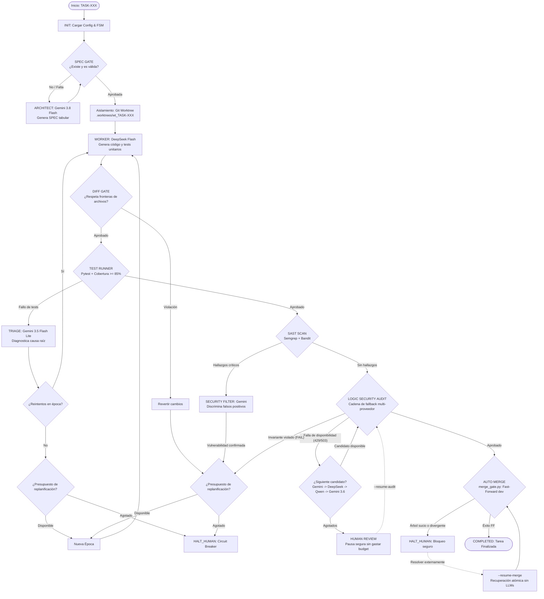

# Autonomous Multi-Agent Software Factory

[English](README.md) | Español

> **Sistema de Desarrollo Autónomo de Software Multi-Agente con Control de Estados Finitos (FSM), Compuertas Deterministas y Aislamiento por Git Worktrees.**

[](https://github.com/LE0ST/autonomous-multi-agent-software-factory/actions/workflows/ci.yml)
[](https://www.python.org/downloads/)
[](https://opensource.org/licenses/MIT)
[](https://github.com/psf/black)

---

> [!WARNING]
> **Aviso de Proyecto Experimental:**
> Este es un proyecto de investigación y portafolio enfocado en la gobernanza, seguridad y control de ejecución de agentes autónomos de codificación. No está pensado para producción sin supervisión humana y opera bajo presupuestos de ejecución estrictos para prevenir loops infinitos y gastos descontrolados de API.

---

## 1. El Problema que Resuelve

La mayoría de los sistemas multi-agente contemporáneos sufren de deficiencias críticas al generar software en el mundo real:

* **Alucinaciones no verificadas:** Confianza excesiva en la auto-evaluación del propio modelo de lenguaje.
* **Fuga de fronteras de código (Scope Creep):** Agentes que modifican archivos de configuración, eliminan tests existentes o tocan módulos ajenos a la tarea encomendada.
* **Loops infinitos y consumo ciego de tokens:** Agentes que entran en bucles de ensayo y error sin límites formales ni presupuestos de parada.
* **Corrupción del árbol de trabajo principal:** Modificaciones realizadas directamente en la rama principal que dejan el repositorio en un estado inconsistente ante fallos de compilación o pruebas.
* **Integraciones sucias:** Fusiones no atómicas o con conflictos silenciosos en el control de versiones.

### La Solución: Fábrica Determinista Gobernada

**Autonomous Multi-Agent Software Factory** introduce una arquitectura donde los modelos de lenguaje (LLMs) **únicamente generan propuestas de código y diagnósticos**, mientras que **el control de flujo, la verificación de seguridad, la ejecución de pruebas y la integración a Git son gobernados por compuertas deterministas no probabilísticas** y una Máquina de Estados Finitos (FSM).

---

## 2. Diagrama del Pipeline y Arquitectura



---

## 3. Componentes y Agentes

| Rol / Agente | Modelo Predeterminado | Proveedor | Responsabilidad |
| :--- | :--- | :--- | :--- |
| **Architect** | `gemini-3.8-flash` | Google Gemini | Analiza requerimientos y formaliza especificaciones técnicas tabulares (`specs/TASK-XXX.md`). |
| **Worker** | `deepseek-flash` | DeepSeek | Genera el código fuente y las pruebas unitarias aisladas en estricto cumplimiento de `RULES.md`. |
| **Triage** | `gemini-3.5-flash-lite` | Google Gemini | Inspecciona fallos de pytest (`stdout`, `stderr`, stacktraces) y diagnostica la causa raíz estructurada. |
| **Security Filter** | `gemini-3.5-flash-lite` | Google Gemini | Revisa hallazgos de herramientas SAST y filtra falsos positivos antes de detener el pipeline. |
| **Logic Security Auditor** | `gemini-3.8-flash` (Primario)<br/>*Fallbacks:* `deepseek-flash`, `qwen3.8-flash`, `gemini-3.6-flash` (soporte `glm-5.3`) | Google Gemini, DeepSeek, Qwen / DashScope, Zhipu GLM | Audita semánticamente que el diff cumpla todos los invariantes (`[SEC-xx]`) bajo una política determinista y fail-closed de fallback multi-proveedor. |

---

## 4. Las Seis Compuertas Deterministas (Deterministic Gates)

1. **`SPEC_GATE` ([`scripts/spec_gate.py`](scripts/spec_gate.py)):**
   Valida que la especificación técnica contenga objetivos claros, tabla de invariantes de seguridad/lógica y fronteras explícitas de archivos permitidos y prohibidos.
2. **`DIFF_GATE` ([`scripts/diff_gate.py`](scripts/diff_gate.py)):**
   Inspecciona `git diff base...HEAD` en el worktree antes de ejecutar cualquier código. Aplica estrictamente:
   - `modified_files ⊆ allowed_files`
   - `forbidden_files ∩ modified_files = ∅`
   Bloquea modificaciones sobre archivos de infraestructura de raíz (`pyproject.toml`, `.env*`, `RULES.md`, `orchestrator/`, `scripts/`).
3. **`TEST_RUNNER` ([`scripts/test_runner.py`](scripts/test_runner.py)):**
   Ejecuta `pytest` exigiendo un umbral mínimo de cobertura de código (por defecto $\ge 85\%$). Si los tests fallan o la cobertura es insuficiente, se bloquea el paso al escaneo de seguridad.
4. **`SAST_SCAN` ([`scripts/sast_runner.py`](scripts/sast_runner.py)):**
   Ejecuta análisis estático de vulnerabilidades mediante **Semgrep** (`p/python`, `p/owasp-top-ten`, `p/cwe-top-25`) y **Bandit**.
5. **`LOGIC_AUDIT` ([`orchestrator.py`](orchestrator.py), [`adapters/`](adapters/)):**
   Verifica semánticamente que los invariantes lógicos y de seguridad (`[SEC-xx]`) no hayan sido vulnerados. Incorpora una cadena determinista de fallback multi-proveedor (`gemini-3.8-flash` $\to$ `deepseek-flash` $\to$ `qwen3.8-flash` $\to$ `gemini-3.6-flash`) activa únicamente ante fallos de disponibilidad (HTTP 429/503), prohibiendo estrictamente el model shopping ante veredictos semánticos de `FAIL`.
6. **`MERGE_GATE` ([`scripts/merge_gate.py`](scripts/merge_gate.py)):**
   Verifica que el repositorio principal esté limpio (`git status --porcelain`) y que no haya divergencias con la rama base (`dev`), ejecutando exclusivamente fusiones atómicas Fast-Forward (`git merge --ff-only`).

---

## 5. Control de Estados (FSM), Presupuestos y Circuit Breakers

El sistema está regulado por [`orchestrator/state_manager.py`](orchestrator/state_manager.py), que persiste el estado en `orchestrator/state/state_<TASK_ID>.json`:

### Estados Formales de la FSM
```text
INIT -> SPEC_DESIGN -> SPEC_GATE -> BUILDING -> DIFF_GATE -> TESTING ->
TRIAGING -> SAST_SCAN -> SAST_FILTER -> LOGIC_AUDIT -> AUTO_MERGE
```
Estados terminales / suspensión: `COMPLETED`, `HALT_HUMAN`, `HUMAN_REVIEW`.

**Rutas Deterministas de Recuperación:**
* **Recuperación de Merge (`--resume-merge`):** `HALT_HUMAN` (en `AUTO_MERGE`) $\to$ `AUTO_MERGE` $\to$ `COMPLETED`
* **Recuperación de Auditoría (`--resume-audit`):** `HUMAN_REVIEW` (en `LOGIC_AUDIT`) $\to$ `LOGIC_AUDIT` $\to$ `AUTO_MERGE` $\to$ `COMPLETED`

### Presupuestos de Ejecución (Execution Budgets)
Definidos en [`orchestrator/config.json`](orchestrator/config.json):
* `max_worker_per_epoch`: **2** intentos del Worker por época de resolución.
* `max_cumulative_worker_runs`: **5** intentos acumulados máximos por tarea.
* `max_logic_replans`: **2** replanificaciones ante fallos persistentes de pruebas.
* `max_security_replans`: **1** replanificación ante vulnerabilidades confirmadas.
* `max_spec_syntax_retries`: **1** reintento de sintaxis de especificación.

### Fallback Multi-Proveedor Determinista para LOGIC_AUDIT
Para garantizar la máxima disponibilidad operativa ante límites de tasa de API (HTTP 429) o caídas del servicio (HTTP 502/503/504) sin comprometer las garantías de seguridad, `LOGIC_AUDIT` implementa una política determinista y fail-closed de fallback multi-proveedor configurada en [`orchestrator/config.json`](orchestrator/config.json):

1. **Modelo Primario:** `gemini` (`gemini-3.8-flash`)
2. **Candidato Fallback 1:** `deepseek` (`deepseek-flash`)
3. **Candidato Fallback 2:** `qwen` (`qwen3.8-flash`) mediante API compatible con OpenAI de DashScope
4. **Candidato Fallback 3:** `gemini` (`gemini-3.6-flash`)
*(Nota: Soporte completo por adaptador implementado también para Zhipu GLM vía `GLMAdapter`).*

**Semántica Estricta de Fallback:**
* **Activación Exclusiva por Fallas de Disponibilidad:** El fallback solo se activa ante errores de transporte de red e indisponibilidad del proveedor (HTTP 429 Too Many Requests, HTTP 502/503/504, caídas de conexión, timeouts de socket) tras agotar los reintentos locales con backoff exponencial (`@retry_with_backoff`).
* **`FAIL` Semántico Nunca Activa Fallback (Sin Model Shopping):** Si un modelo evaluador se comunica con éxito y dictamina que el diff viola un invariante de seguridad (`FAIL`), el veredicto es definitivo. No se consulta a ningún modelo subsiguiente; el fallo consume de inmediato un presupuesto de replanificación de seguridad y retorna el control a Triage y Worker.
* **Detención en el Primer Veredicto:** La ejecución del proceso de auditoría se detiene en el primer modelo que devuelva exitosamente `PASS`.
* **Suspensión Segura ante Ambigüedad o Agotamiento:** Si un modelo devuelve un veredicto ambiguo (`UNCERTAIN`) o un JSON corrupto/malformado, la ejecución pasa de inmediato a `HUMAN_REVIEW` sin probar modelos adicionales. Si todos los modelos de la cadena de fallback sufren fallas de disponibilidad de red, la tarea pausa de forma segura en `HUMAN_REVIEW`.
* **Cero Consumo de Presupuestos:** El cambio entre modelos ante fallas de transporte/red **no** consume intentos del Worker, replanificaciones lógicas ni replanificaciones de seguridad. El contador de épocas permanece intacto.
* **Registro Estructurado en el Estado:** El proveedor y modelo que ejecutaron exitosamente la auditoría se registran de forma determinista bajo `audit_model_used: {"provider": "<provider>", "model": "<model>"}` en `state_<TASK_ID>.json` sin exponer credenciales.

### Circuit Breaker y HUMAN_REVIEW
* **`CRASH_REPORT_<TASK_ID>.md`:** Si se agota cualquier presupuesto o se detecta una condición fatal, el Circuit Breaker detiene el proceso y genera un informe forense no destructivo.
* **`HUMAN_REVIEW`:** Si un servicio de auditoría externo devuelve errores de red persistentes (HTTP 429 Too Many Requests o 503 Service Unavailable), el pipeline entra en pausa controlada **sin consumir presupuestos de Worker**.
* **`--resume-merge`:** Permite recuperar una tarea autorizada que completó todas las compuertas pero se detuvo en `AUTO_MERGE` (por ejemplo, por tener archivos sin commitear en el árbol de trabajo). Realiza exclusivamente la fusión Fast-Forward sin invocar agentes, compuertas ni consumir presupuestos.
* **`--resume-audit`:** Mecanismo de recuperación seguro para tareas pausadas en `HUMAN_REVIEW` con `blocked_reason.gate == LOGIC_AUDIT` (por ejemplo, tras límites de tasa HTTP 429 o 503). Reanuda exclusivamente la auditoría lógica de seguridad pendiente sin volver a ejecutar Worker, pytest, SAST ni consumir presupuestos de reintentos/replanificación. Si la auditoría aprueba, avanza hacia `AUTO_MERGE`. Valida que `dev` sea ancestro antes de ejecutar y nunca realiza rebases automáticos, preservando el worktree si existe divergencia.

---

## 6. Instalación y Requisitos

### Requisitos del Sistema
* **Python:** `>= 3.10`
* **Git:** `>= 2.30`
* **Semgrep:** `>= 1.0.0`
* Compatible con Windows (PowerShell) y Linux / macOS.

### Instalación

```powershell
# 1. Clonar el repositorio
git clone https://github.com/LE0ST/autonomous-multi-agent-software-factory.git
cd autonomous-multi-agent-software-factory

# 2. Crear y activar entorno virtual
python -m venv .venv
.venv\Scripts\Activate.ps1   # En Windows PowerShell
# source .venv/bin/activate  # En Linux / macOS

# 3. Instalar el proyecto y dependencias mediante pyproject.toml
pip install -e .
```

### Configuración de Credenciales
Copia `.env.example` como `.env`:
```powershell
cp .env.example .env
```
Edita `.env` con tus claves de API:
```ini
GEMINI_API_KEY=tu-clave-de-gemini
DEEPSEEK_API_KEY=tu-clave-de-deepseek
GLM_API_KEY=tu-clave-de-glm              # Opcional para Zhipu GLM
DASHSCOPE_API_KEY=tu-clave-de-dashscope  # Opcional para fallback con Qwen (qwen3.8-flash)
```

---

## 7. Guía de Uso y Quick Start Seguro

### Flujo de Trabajo Recomendado (Paso a Paso)

Para ejecutar una tarea de forma segura en la fábrica, se debe cumplir con las invariantes de estado limpio:

1. **Trabajar Siempre desde `dev`:**
   Asegúrate de estar en la rama `dev` y sincronizado con el repositorio remoto:
   ```powershell
   git checkout dev
   git pull --ff-only origin dev
   ```

2. **Definir el Contrato de Especificación:**
   Crea un nuevo archivo de especificación (ej. `specs/TASK-004.md`) basado estrictamente en [`specs/TEMPLATE.md`](specs/TEMPLATE.md). Define Criterios de Aceptación inequívocos (`[AC-xx]`), Invariantes de Seguridad (`[SEC-xx]`), listas explícitas de archivos permitidos y prohibidos (`Allowed files` / `Forbidden files`), y la Matriz de Pruebas completa.

3. **Añadir y Commitear la SPEC antes de Ejecutar el Orquestador:**
   > [!IMPORTANT]
   > **Invariante Previo a la Ejecución:** Es indispensable añadir y hacer commit de la especificación técnica antes de invocar `orchestrator.py`. Confirma que `git status --short` retorne un árbol de trabajo completamente limpio. La compuerta final de integración (`merge_gate.py`) verifica el estado mediante `git status --porcelain` y abortará la fusión si detecta archivos sin commitear o sin seguimiento en la raíz del repositorio.
   ```powershell
   git add specs/TASK-004.md
   git commit -m "spec: add TASK-004 contract"
   git status --short  # Debe estar completamente vacío
   ```

4. **Ejecutar el Pipeline del Orquestador:**
   ```powershell
   python orchestrator.py TASK-004
   ```
   **Recorrido Determinista del Pipeline:**
   * **`SPEC_GATE`:** Valida la estructura markdown, secciones obligatorias, trazabilidad de criterios AC/SEC y declaraciones de fronteras de archivos.
   * **`BUILDING`:** Crea un Git worktree aislado (`.worktrees/wt_TASK-004`) en la rama `task/TASK-004`. El Worker genera código fuente y pruebas unitarias bajo `RULES.md`.
   * **`DIFF_GATE`:** Aplica fronteras de archivos mediante teoría de conjuntos (`modified_files ⊆ allowed_files` y `forbidden_files ∩ modified_files = ∅`).
   * **`TESTING`:** Ejecuta `pytest` exigiendo cobertura de código ($\ge 85\%$). Si hay fallos, Triage diagnostica la causa y gestiona reintentos dentro de la época.
   * **`SAST_SCAN`:** Escanea el código con Semgrep y Bandit; los hallazgos son discriminados por el Security Filter para descartar falsos positivos.
   * **`LOGIC_AUDIT`:** Un modelo independiente audita semánticamente el diff de Git contra los invariantes de seguridad de la especificación.
   * **`AUTO_MERGE`:** `merge_gate.py` comprueba que el repositorio principal esté limpio y ejecuta una fusión atómica Fast-Forward en `dev` (`git merge --ff-only`).

5. **Verificar el Resultado:**
   Al finalizar la ejecución, comprueba la integridad del sistema:
   ```powershell
   python -m pytest -v tests/
   git status --short
   git log --oneline --decorate -5
   ```

---

### Ejemplo de Flujo Copiable

```bash
git checkout dev
git pull --ff-only origin dev

# Create specs/TASK-004.md from specs/TEMPLATE.md

git add specs/TASK-004.md
git commit -m "spec: add TASK-004 contract"
git status --short

python orchestrator.py TASK-004

python -m pytest -v tests/
git status --short
git log --oneline --decorate -5
```

---

### Recuperación Determinista de Merge (`--resume-merge`)

Si una tarea autorizada superó con éxito todas las compuertas de verificación (`SPEC_GATE`, `DIFF_GATE`, `TESTING`, `SAST_SCAN`, `LOGIC_AUDIT`) pero se detuvo específicamente durante `AUTO_MERGE` (por ejemplo, por modificaciones locales sin commitear en el árbol principal):

```powershell
python orchestrator.py --resume-merge TASK-XXX
```

> [!NOTE]
> **Alcance Estricto de `--resume-merge`:**
> * `--resume-merge` es **exclusivamente un mecanismo de recuperación** cuando la tarea se detuvo en `AUTO_MERGE`.
> * **No** vuelve a ejecutar Worker, pytest, SAST, Triage ni agentes de auditoría de seguridad.
> * **No** consume presupuestos de Worker ni de replanificación (`worker_attempts_in_epoch` y `total_cumulative_worker_runs` permanecen intactos).
> * **No** es una solución genérica para estados arbitrarios de `HALT_HUMAN` (por ejemplo, fallos de tests o rechazos de seguridad no pueden eludirse con `--resume-merge`).
> * Valida la existencia de la rama de tarea, la limpieza del repositorio principal y la relación de ancestralidad, ejecutando únicamente `git merge --ff-only`.

---

### Recuperación Determinista de Auditoría (`--resume-audit`)

Si una tarea autorizada superó todas las compuertas previas de verificación (`SPEC_GATE`, `DIFF_GATE`, `TESTING`, `SAST_SCAN`) pero entra en pausa en `HUMAN_REVIEW` en `LOGIC_AUDIT` debido a límites de tasa transitorios de API o indisponibilidad de red (ej. HTTP 429 Too Many Requests o 503 Service Unavailable):

```powershell
python orchestrator.py --resume-audit TASK-XXX
```

> [!NOTE]
> **Alcance Estricto de `--resume-audit`:**
> * `--resume-audit` está **estrictamente autorizado** únicamente para tareas en `HUMAN_REVIEW` donde `blocked_reason.gate == "LOGIC_AUDIT"` y existe la transición previa `LOGIC_AUDIT -> HUMAN_REVIEW` en el historial.
> * **No** vuelve a ejecutar Worker, Architect, Triage, `SPEC_GATE`, `DIFF_GATE`, `TESTING` (pytest) ni `SAST_SCAN`.
> * **No** consume intentos del Worker por época ni presupuestos de replanificación (`worker_attempts_in_epoch`, `logic_replans`, `security_replans` permanecen intactos).
> * Reintenta **exclusivamente** la auditoría lógica de seguridad pendiente contra el worktree preservado.
> * Si persiste el límite de tasa externo (HTTP 429 / 503), retorna de forma segura a `HUMAN_REVIEW` sin penalización.
> * Si la auditoría aprueba y se cumple la condición de Fast-Forward, remueve el worktree y ejecuta `AUTO_MERGE` hacia `dev`.
> * Si se detecta divergencia en Git (`dev` no es ancestro de `task/<task_id>`), **deniega estrictamente la recuperación y no realiza rebase automático**, preservando el worktree intacto para reconciliación manual.

---

### Diagnóstico y Solución de Problemas (Troubleshooting)

#### La SPEC sin seguimiento bloquea `AUTO_MERGE` (Caso Real TASK-003)
* **Síntoma:** Durante la ejecución, todas las compuertas aprueban, pero el pipeline se detiene en el paso final de integración con `HALT_HUMAN`:
  ```text
  [MERGE_GATE] Main repository has uncommitted modifications. Merge aborted.
  ```
* **Causa Raíz:** Crear `specs/TASK-XXX.md` sin commitearla deja el archivo sin seguimiento (`?? specs/TASK-XXX.md`). Aunque el orquestador trabaja dentro de `.worktrees/wt_TASK-XXX`, cuando `AUTO_MERGE` intenta hacer fast-forward merge de `task/TASK-XXX` hacia `dev`, `merge_gate.py` detecta suciedad en el repositorio principal.
* **Solución Preventiva:** Siempre añade y commitea `specs/TASK-XXX.md` **antes** de ejecutar `orchestrator.py` (`git add specs/... && git commit -m "spec: ..."`).
* **Solución de Recuperación:** Si esto ocurre:
  1. Haz commit del archivo de especificación pendiente:
     ```powershell
     git add specs/TASK-XXX.md
     git commit -m "spec: add TASK-XXX contract"
     git status --short  # Confirmar limpio
     ```
  2. Ejecuta la recuperación atómica de merge sin re-ejecutar agentes ni gastar tokens:
     ```powershell
     python orchestrator.py --resume-merge TASK-XXX
     ```

---

### Modos Adicionales de Operación

#### Modo Simulación (Dry-Run sin consumo de API)
Permite validar compuertas, creación de ramas y flujo de integración sin realizar llamadas a LLMs:
```powershell
python orchestrator.py TASK-001 --simulate
```

#### Ejecutar la Suite de Pruebas
```powershell
python -m pytest -v tests/
```
La suite completa de pruebas (202 pruebas unitarias y de integración) se ejecuta localmente sin requerir acceso a redes externas ni claves de API.

---

## 8. Casos de Estudio: `TASK-001`, `TASK-002`, `TASK-003`, `TASK-004` y `TASK-005`

El repositorio incluye la ejecución y validación completa de cinco tareas reales integradas en `dev`:

1. **`TASK-001`**: Módulo de validación de tokens (`src/auth/token_validator.py`):
   * **Especificación:** [`specs/TASK-001.md`](specs/TASK-001.md) definió validación de tokens con comparación segura (`hmac.compare_digest`), rechazando tokens vacíos o inválidos.
   * **Worker:** Generó implementación y pruebas unitarias en [`tests/test_token_validator.py`](tests/test_token_validator.py).
   * **Compuertas:** Superó todas las compuertas deterministas e integración Fast-Forward en `dev`.

2. **`TASK-002`**: Validador seguro de contraseñas (`src/auth/password_validator.py`):
   * **Especificación:** [`specs/TASK-002.md`](specs/TASK-002.md) definió criterios formales `[AC-01]` y `[AC-02]` (longitud mínima de 8 caracteres, rechazo de valores vacíos y requerimiento obligatorio de al menos una letra y un dígito) e invariantes de seguridad `[SEC-01]` y `[SEC-02]` (la función nunca imprime en stdout/stderr, registra en logs ni persiste en disco la contraseña recibida, sin credenciales codificadas).
   * **Worker:** Generó la función pura `validate_password(password: str) -> bool` y 24 pruebas unitarias exhaustivas en [`tests/test_password_validator.py`](tests/test_password_validator.py).
   * **Compuertas:** Superó `SPEC_GATE`, `DIFF_GATE`, `TESTING` (cobertura 100%), `SAST_SCAN` y `LOGIC_AUDIT`.
   * **Integración:** Recuperado e integrado en `dev` mediante `--resume-merge` tras resolución de divergenicas, verificable en el historial de Git.

3. **`TASK-003`**: Limitador de tasa en memoria (`src/security/rate_limiter.py`):
   * **Especificación:** [`specs/TASK-003.md`](specs/TASK-003.md) definió una clase limitadora por ventana temporal configurable `RateLimiter` (`allow(client_id, now)`) con criterios de aceptación `[AC-01]` a `[AC-05]` e invariantes de seguridad estrictos `[SEC-01]` a `[SEC-03]` (sin E/S, sin persistencia externa, sin filtrado de identificadores en logs y estado encapsulado en la instancia).
   * **Worker:** Generó la clase `RateLimiter` y pruebas unitarias exhaustivas en [`tests/test_rate_limiter.py`](tests/test_rate_limiter.py).
   * **Compuertas e Integración:** Superó las compuertas de verificación (`SPEC_GATE`, `DIFF_GATE`, `TESTING`, `SAST_SCAN`, `LOGIC_AUDIT`), se detuvo inicialmente en `AUTO_MERGE` con `HALT_HUMAN` debido a un archivo de especificación sin seguimiento en el repositorio principal, y se integró limpiamente en `dev` tras asegurar la limpieza del árbol de trabajo.

4. **`TASK-004`**: Caché TTL/LRU en memoria con seguridad de hilos (`src/cache/ttl_cache.py`):
   * **Especificación:** [`specs/TASK-004.md`](specs/TASK-004.md) definió una clase concurrente `TTLCache` con capacidad (`max_size`) y expiración por defecto (`default_ttl`) configurables, operaciones `set`, `get`, `delete`, `clear`, desalojo LRU de entradas activas, soporte concurrente multi-hilo (`[AC-01]` a `[AC-10]`) e invariantes de seguridad (`[SEC-01]` a `[SEC-04]`).
   * **Worker Intento 1 y Triage:** En la Época 1, el primer intento del Worker generó el código inicial, pero falló en la compuerta `TESTING` debido a una condición de carrera bajo concurrencia. La compuerta determinista de pruebas detectó el fallo e invocó al modelo de **Triage**, el cual analizó el stack trace y diagnosticó la causa raíz de concurrencia.
   * **Worker Intento 2:** Con base en el diagnóstico estructurado de Triage, el intento 2 del Worker corrigió los mecanismos de sincronización y desalojo.
   * **Compuertas y Pausa:** El intento 2 superó `DIFF_GATE`, `TESTING` (100% de cobertura en 19 pruebas unitarias en [`tests/test_ttl_cache.py`](tests/test_ttl_cache.py)) y `SAST_SCAN` (cero vulnerabilidades en Semgrep y Bandit). En `LOGIC_AUDIT`, se produjo un error de límite de tasa del proveedor (HTTP 429); el pipeline pausó de manera segura en `HUMAN_REVIEW` sin consumir presupuestos de replanificación del Worker.
   * **Recuperación e Integración:** Tras superarse la saturación del servicio, se ejecutó la recuperación mediante `--resume-audit TASK-004`. La auditoría lógica aprobó el diff, el worktree fue desvinculado limpiamente y la tarea concluyó en `AUTO_MERGE -> COMPLETED` mediante fusión Fast-Forward hacia `dev`.

5. **`TASK-005`**: Motor de políticas de autorización multi-inquilino (`src/security/authorization_policy.py`):
   * **Especificación:** [`specs/TASK-005.md`](specs/TASK-005.md) definió una clase de políticas sin estado y con denegación por defecto `AuthorizationPolicy` con `is_allowed(subject_tenant: str, resource_tenant: str, roles: set[str], action: str) -> bool` (`[AC-01]`, `[AC-02]`). Exigió denegación por defecto (`[AC-03]`), aislamiento estricto de inquilinos donde el acceso solo se concede si `subject_tenant == resource_tenant` para todos los roles incluido `admin` (`[AC-04]`, `[AC-05]`), permisos por rol (`viewer`: `read`; `editor`: `read`, `write`; `admin`: `read`, `write`, `delete`) (`[AC-06]`), y denegación estricta ante roles o acciones desconocidos o conjuntos vacíos (`[AC-07]` a `[AC-10]`). Los invariantes de seguridad prohibieron el acceso entre inquilinos (`[SEC-01]`), exigieron comportamiento fail-closed ante entradas inválidas o malformadas (`[SEC-02]`), vetaron desvíos o comodines (`[SEC-03]`), prohibieron la emisión de datos a disco/logs/stdout/stderr (`[SEC-04]`), vedaron estado global mutable (`[SEC-05]`), y prohibieron ejecución dinámica (`eval`, `exec`, subprocesos o red) (`[SEC-06]`).
   * **Worker:** En la Época 1 intento 1, el Worker generó la clase en [`src/security/authorization_policy.py`](src/security/authorization_policy.py) y 70 pruebas unitarias exhaustivas en [`tests/test_authorization_policy.py`](tests/test_authorization_policy.py).
   * **Compuertas y Pausa:** Superó `SPEC_GATE`, `DIFF_GATE`, `TESTING` (100% de cobertura en 70 pruebas unitarias) y `SAST_SCAN` (cero vulnerabilidades). En `LOGIC_AUDIT`, una indisponibilidad de API del proveedor primario (HTTP 503 Service Unavailable) provocó la pausa en `HUMAN_REVIEW` sin consumir presupuestos de Worker ni replanificación.
   * **Reconciliación e Integración:** Tras reconciliar la divergencia con `dev` por actualizaciones independientes, se ejecutó `--resume-audit TASK-005`. La auditoría final fue superada exitosamente mediante `gemini:gemini-3.8-flash`. El worktree fue liberado y la tarea se fusionó en avance rápido hacia `dev` (`AUTO_MERGE -> COMPLETED`).

---

## 9. Estructura del Repositorio

```text
.
├── .env.example                # Plantilla de credenciales segura
├── .gitignore                  # Reglas de exclusión de Git
├── .semgrepignore              # Reglas de exclusión para SAST
├── CONTRIBUTING.md             # Guía de contribución (English)
├── CONTRIBUTING_ES.md          # Guía de contribución (Español)
├── LICENSE                     # Licencia MIT
├── pyproject.toml              # Metadatos del paquete y dependencias
├── README.md                   # Documentación principal en inglés
├── README_ES.md                # Documentación en español
├── RULES.md                    # Reglas de gobernanza para el Worker
│
├── .github/workflows/          # Integración continua
│   └── ci.yml                  # Workflow de GitHub Actions
│
├── adapters/                   # Adaptadores de proveedores LLM
│   ├── contracts.py            # Modelos Pydantic v2 de entrada/salida
│   ├── deepseek_adapter.py     # Worker / Code Generator
│   ├── gemini_adapter.py       # Architect, Triage, Security Filter, Logic Security
│   ├── glm_adapter.py          # Logic Security alternativo
│   ├── network_retry.py        # Resiliencia HTTP con backoff exponencial
│   ├── qwen_adapter.py         # Fallback de Logic Security con DashScope / Qwen
│   └── sanitizer.py            # Redacción de secretos e higiene de credenciales
│
├── orchestrator/               # Núcleo del orquestador y FSM
│   ├── config.json             # Presupuestos, roles y umbrales
│   ├── env_loader.py           # Cargador seguro de variables de entorno
│   └── state_manager.py        # Máquina de estados finitos y persistencia
│
├── scripts/                    # Compuertas deterministas de verificación
│   ├── diff_gate.py            # Validación de fronteras de modificación
│   ├── discovery.py            # Análisis de estructura del proyecto
│   ├── merge_gate.py           # Fusión Fast-Forward atómica a dev
│   ├── sast_runner.py          # Escáner de seguridad Semgrep / Bandit
│   ├── spec_gate.py            # Validador sintáctico y de invariantes de SPEC
│   ├── test_runner.py          # Ejecutor de pytest con cobertura >= 85%
│   └── worktree_manager.py     # Gestor de aislamiento por Git Worktrees
│
├── specs/                      # Especificaciones de tareas
│   ├── TASK-001.md             # Especificación de autenticación de tokens
│   ├── TASK-002.md             # Especificación de validador de contraseñas
│   ├── TASK-003.md             # Especificación de limitador de tasa en memoria
│   ├── TASK-004.md             # Especificación de caché TTL/LRU con seguridad de hilos
│   ├── TASK-005.md             # Especificación de política de autorización multi-inquilino
│   └── TEMPLATE.md             # Plantilla canónica de especificaciones
│
├── src/                        # Código productivo generado e integrado
│   ├── auth/
│   │   ├── password_validator.py
│   │   └── token_validator.py
│   ├── cache/
│   │   └── ttl_cache.py
│   └── security/
│       ├── authorization_policy.py
│       └── rate_limiter.py
│
└── tests/                      # Suite de pruebas automatizadas (202 pruebas)
    ├── test_audit_fallback.py
    ├── test_authorization_policy.py
    ├── test_deepseek_adapter.py
    ├── test_diff_gate.py
    ├── test_e2e_dry_run.py
    ├── test_gemini_adapter.py
    ├── test_network_retry.py
    ├── test_password_validator.py
    ├── test_rate_limiter.py
    ├── test_resume_audit.py
    ├── test_resume_merge.py
    ├── test_sanitizer.py
    ├── test_spec_gate.py
    ├── test_state_manager.py
    ├── test_token_validator.py
    └── test_ttl_cache.py
```

---

## 10. Limitaciones Actuales y Roadmap

### Limitaciones Actuales
* **Monolenguaje (Python):** Las compuertas de análisis estático y ejecución de pruebas están optimizadas actualmente para proyectos Python.
* **Secuencia Lineal de Épocas:** Aunque el Worker ejecuta reintentos locales, el orquestador trabaja una sola tarea activa a la vez por repositorio.
* **Modelos Propietarios:** Requiere claves de API comerciales (Google Gemini, DeepSeek o Zhipu GLM).

### Roadmap
- [ ] Soporte para modelos locales mediante Ollama / vLLM (reducción a costo cero de tokens para Worker y Triage).
- [ ] Soporte políglota para compuertas de pruebas (Node.js/TypeScript con Jest/Vitest, Rust con `cargo test`).
- [ ] Paralelización concurrente de múltiples tareas en worktrees independientes.
- [ ] Generación automática de especificaciones arquitectónicas a partir de issues de GitHub.
- [ ] Dashboard interactivo de telemetría de estados y costos de tokens por tarea.

---

## 11. Licencia

Este proyecto se distribuye bajo la licencia **MIT**. Consulta el archivo [`LICENSE`](LICENSE) para más detalles.
