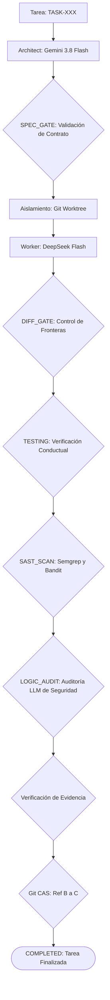

# Autonomous Multi-Agent Software Factory

[English](README.md) | Español

> **Sistema de Desarrollo Autónomo de Software Multi-Agente con Control de Estados Finitos (FSM), Compuertas Deterministas de Verificación, Presupuestos de Ejecución, Aislamiento por Git Worktrees y Evidencia Criptográfica Encadenada.**

[](https://github.com/LE0ST/autonomous-multi-agent-software-factory/actions/workflows/ci.yml)
[](https://www.python.org/downloads/)
[](https://opensource.org/licenses/MIT)
[](https://github.com/psf/black)

---

> [!WARNING]
> **Aviso de Proyecto Experimental de Investigación y Estado de Auditoría de Seguridad:**
> * **Commit Base Publicado (`c5fd13c`):** Representa la versión pública inicial que contiene 202 pruebas unitarias y de integración, compuertas de verificación heurísticas e integración Fast-Forward en el worktree.
> * **Estado Actual de Desarrollo Local (aún no publicado):** Incorpora un extenso endurecimiento de seguridad derivado de la Ronda 3.6 (contexto de verificación inmutable, desafíos ocultos evaluados en el controlador, encadenamiento de evidencia HMAC y actualizaciones atómicas de referencias Git mediante Compare-and-Swap) y el punto de control de la Ronda 3.7 Etapa 1 (50 casos de aceptación congelados en seis archivos de pruebas y dos archivos auxiliares de Python).
> * **Remediación de Seguridad Pendiente:** Una auditoría de seguridad independiente concluyó que la Ronda 3.6 **no** recibe aprobación de seguridad (Security PASS), confirmando cinco defectos de seguridad (S1–S5) y tres regresiones funcionales (F1–F3). La Etapa 1 estableció **31 casos genuinos de fallo previo (FAIL-before) y 19 controles aprobados**. El código de producción permanece sin modificaciones respecto a la Ronda 3.6; **la remediación de seguridad en producción continúa pendiente**.

---

## 1. El Problema que Resuelve

La mayoría de los sistemas multi-agente contemporáneos sufren de deficiencias críticas al generar software en el mundo real:

* **Alucinaciones no verificadas:** Confianza excesiva en la auto-evaluación del propio modelo de lenguaje.
* **Fuga de fronteras de código (Scope Creep):** Agentes que modifican archivos de configuración, eliminan tests existentes o tocan módulos ajenos a la tarea encomendada.
* **Loops infinitos y consumo ciego de tokens:** Agentes que entran en bucles de ensayo y error sin límites formales ni presupuestos de parada.
* **Corrupción del árbol de trabajo principal:** Modificaciones realizadas directamente en la rama principal que dejan el repositorio en un estado inconsistente ante fallos de compilación o pruebas.
* **Integraciones sucias:** Fusiones no atómicas o con conflictos silenciosos en el control de versiones.

### La Solución: Fábrica Determinista Gobernada

**Autonomous Multi-Agent Software Factory** desacopla la generación del gobierno. Los modelos de lenguaje (LLMs) **únicamente generan propuestas de código, especificaciones y diagnósticos**, mientras que **el control de flujo, la verificación de seguridad, la ejecución de pruebas, las fronteras de archivos y la integración a Git son gobernados por compuertas deterministas no probabilísticas**, una Máquina de Estados Finitos (FSM) transaccional y evidencia criptográfica de verificación.

---

## 2. Diagrama del Pipeline y Arquitectura


```mermaid
flowchart TD
    Task["Tarea: TASK-XXX"] --> Architect["Architect: Gemini 3.8 Flash"]
    Architect --> SPEC_GATE{"SPEC_GATE: Validación de Contrato"}
    SPEC_GATE --> Worktree["Aislamiento: Git Worktree"]
    Worktree --> Worker["Worker: DeepSeek Flash"]
    Worker --> DIFF_GATE{"DIFF_GATE: Control de Fronteras"}
    DIFF_GATE --> TESTING{"TESTING: Verificación Conductual"}
    TESTING --> SAST_SCAN{"SAST_SCAN: Semgrep y Bandit"}
    SAST_SCAN --> LOGIC_AUDIT{"LOGIC_AUDIT: Auditoría LLM de Seguridad"}
    LOGIC_AUDIT --> EvidenceVerification{"Verificación de Evidencia"}
    EvidenceVerification --> CAS{"Git CAS: Ref B a C"}
    CAS --> COMPLETED(["COMPLETED: Tarea Finalizada"])
```

> [!NOTE]
> **Evolución desde la Base Publicada hacia la Arquitectura Endurecida:**
> * **Flujo Esencial del Pipeline:** El diagrama ilustra la secuencia lineal de verificación. Las rutas de error (reversión de diff ante violaciones de fronteras, bucles de diagnóstico por Triage ante fallos de tests, replanificación de seguridad ante hallazgos confirmados de SAST/auditoría y detenciones por circuit-breaker) están gobernadas por presupuestos estrictos de ejecución explicados en la prosa y la configuración.
> * **Base Publicada vs. Desarrollo Local:** En el commit base publicado (`c5fd13c`), `TESTING` ejecutaba pytest del lado del cliente con informes de cobertura, y la integración se realizaba mediante `git merge --ff-only` sobre el worktree. En el nuevo estado de desarrollo local (aún no publicado), `TESTING` evalúa desafíos ocultos en el controlador (restringidos al contrato `password-v36`), y la integración se ejecuta mediante un Compare-and-Swap (CAS) atómico en la referencia Git (`git update-ref` CAS B → C).
> * **Revisión Humana y Recuperación:** Las tareas suspendidas en `LOGIC_AUDIT` por fallos transitorios de disponibilidad del proveedor (HTTP 429/503) pasan a `HUMAN_REVIEW` sin consumir presupuesto, recuperables mediante `--resume-audit`. Las tareas detenidas en `AUTO_MERGE` pueden recuperarse mediante `--resume-merge`. Las capacidades de recuperación están diseñadas para un solo uso (sujetas al defecto confirmado S5).
> * **Limitaciones de Seguridad Pendientes:**
>   - **S2 no resuelto:** La evidencia firmada confirma la integridad y secuencia del registro, pero no prueba la ejecución concreta de la compuerta (`_record_success` acepta nombres de compuerta provistos por el llamador).
>   - **S1 no resuelto:** El testigo de frescura local no previene la restauración (rollback) o eliminación conjunta del estado y del testigo cuando los permisos del directorio permiten modificación.
>   - **Brecha de Worktree F1:** El CAS exclusivo sobre la referencia avanza la punta de la rama pero no sincroniza automáticamente el árbol de trabajo principal.

---

## 3. Componentes y Agentes

| Rol / Agente | Modelo Predeterminado | Proveedor | Responsabilidad |
| :--- | :--- | :--- | :--- |
| **Architect** | `gemini-3.8-flash` | Google Gemini | Analiza requerimientos y formaliza especificaciones técnicas tabulares (`specs/TASK-XXX.md`). |
| **Worker** | `deepseek-flash` | DeepSeek | Genera el código fuente y las pruebas unitarias aisladas en estricto cumplimiento de `RULES.md`. |
| **Triage** | `gemini-3.5-flash-lite` | Google Gemini | Inspecciona fallos de pruebas (`stdout`, `stderr`, stack traces) y diagnostica la causa raíz estructurada. |
| **Security Filter** | `gemini-3.5-flash-lite` | Google Gemini | Revisa hallazgos de herramientas SAST y filtra falsos positivos antes de detener el pipeline. |
| **Logic Security Auditor** | `gemini-3.8-flash` (Primario)<br/>*Fallbacks:* `deepseek-flash`, `qwen3.8-flash`, `gemini-3.6-flash` (soporte `glm-5.3`) | Google Gemini, DeepSeek, Qwen / DashScope, Zhipu GLM | Audita semánticamente que el diff cumpla todos los invariantes (`[SEC-xx]`) bajo una política determinista y fail-closed de fallback multi-proveedor. |

---

## 4. Las Seis Compuertas Deterministas de Verificación

1. **`SPEC_GATE` ([`scripts/spec_gate.py`](scripts/spec_gate.py)):**
   Valida que la especificación contenga objetivos claros, Criterios de Aceptación (`[AC-xx]`), Invariantes de Seguridad (`[SEC-xx]`), listas explícitas de archivos permitidos y prohibidos (`Allowed files` / `Forbidden files`) y trazabilidad 1:1 en la Matriz de Pruebas.
2. **`DIFF_GATE` ([`scripts/diff_gate.py`](scripts/diff_gate.py)):
   Inspecciona `git diff B..C` frente a la especificación congelada. Aplica estrictamente fronteras de teoría de conjuntos:
   - `modified_files ⊆ allowed_files`
   - `forbidden_files ∩ modified_files = ∅`
   Bloquea modificaciones sobre archivos de infraestructura de raíz (`pyproject.toml`, `.env*`, `RULES.md`, `orchestrator/`, `scripts/`).
3. **`TESTING` / Verificación Conductual ([`scripts/test_runner.py`](scripts/test_runner.py); suite de investigación local: `trusted_tests/suite.py`):**
   * **Base Publicada:** Ejecutaba `pytest` exigiendo ≥ 85% de cobertura en archivos de la tarea.
   * **Arquitectura Endurecida:** Las afirmaciones de ejecución y cobertura provenientes del candidato no son confiables. El controlador genera dinámicamente 149 desafíos conductuales ocultos que cubren condiciones de frontera, Unicode y tipos inválidos. El oráculo del controlador evalúa las salidas frente a booleanos esperados mantenidos en memoria.
   * **Alcance Actual:** Restringido al contrato `password-v36` (`require_pytest=false`). La compleción autoritativa de pytest y la ejecución general de pruebas corresponden a etapas futuras de la fábrica.
4. **`SAST_SCAN` ([`scripts/sast_runner.py`](scripts/sast_runner.py); reglas locales de investigación: `scripts/semgrep_rules.yml`):**
   Ejecuta análisis estático mediante reglas locales versionadas de **Semgrep** y **Bandit**. La invocación del escáner está aislada a módulos del controlador; los errores de herramienta (código de salida 2) fallan en modo cerrado (fail-closed) y detienen el pipeline antes de la auditoría o integración.
5. **`LOGIC_AUDIT` ([`orchestrator.py`](orchestrator.py), `orchestrator/logic_audit.py` en estado de investigación local, [`adapters/`](adapters/)):**
   Un auditor LLM independiente verifica que el diff inmutable de Git `B..C` cumpla estrictamente los invariantes de seguridad (`[SEC-xx]`). Opera bajo una cadena determinista de fallback multi-proveedor (`gemini-3.8-flash` → `deepseek-flash` → `qwen3.8-flash` → `gemini-3.6-flash`) activa únicamente ante fallos de transporte (HTTP 429/503), prohibiendo el model shopping ante un `FAIL` semántico. El modo simulación no puede emitir evidencia de éxito.
6. **`MERGE_GATE` ([`scripts/merge_gate.py`](scripts/merge_gate.py)):**
   Ejecuta un Compare-and-Swap (CAS) atómico en la referencia Git (B → C) utilizando `git update-ref`. Exige que la rama base apunte con exactitud a B y que existan los cuatro registros auténticos de evidencia firmados con HMAC en secuencia estricta. (Véase la Regresión Funcional F1 sobre la sincronización del árbol de trabajo).

---

## 5. Control de Estados (FSM), Presupuestos y Recuperación

El ciclo de vida de la tarea está regulado por [`orchestrator/state_manager.py`](orchestrator/state_manager.py), que persiste el estado en `orchestrator/state/state_<TASK_ID>.json`:

### Estados Formales de la FSM
```text
INIT -> SPEC_DESIGN -> SPEC_GATE -> BUILDING -> DIFF_GATE -> TESTING ->
TRIAGING -> SAST_SCAN -> SAST_FILTER -> LOGIC_AUDIT -> AUTO_MERGE
```
Estados terminales / suspensión: `COMPLETED`, `HALT_HUMAN`, `HUMAN_REVIEW`.

### Persistencia Transaccional del Estado
* **`StateLock`:** Implementa reentrancia intra-proceso (`threading.RLock`) combinada con bloqueo de archivos a nivel de kernel entre procesos (`msvcrt` en Windows, `fcntl.flock` en POSIX).
* **Reemplazo Atómico:** Toda mutación ocurre exclusivamente a través de `_transaction`, que recarga el estado autoritativo, valida transiciones terminales, incrementa el contador de generación, realiza flush y fsync de archivos temporales y reemplaza atómicamente el archivo de estado.
* **Testigo de Frescura:** El esquema 36 y un testigo de frescura SHA-256 en el archivo de bloqueo detectan reintentos de instantáneas de un solo archivo cuando se conserva el testigo. Sin embargo, como demostró el defecto confirmado S1, el testigo no previene la restauración (rollback) o eliminación si tanto el archivo de estado como el de testigo se restauran o eliminan juntos. Las APIs directas `save()`, `_save_unlocked()` y `_write_snapshot()` han sido eliminadas.

### Mecanismos de Recuperación y Capacidades Opacas
* **Capacidades Opacas:** Las APIs de recuperación (`validate_strict_recovery`, `can_resume_merge`, `can_resume_audit`, `authorize_recovery`, `execute_merge_recovery_transition`, `execute_audit_recovery_transition`) emiten objetos opacos y vinculados a la generación únicamente tras re-verificar las comprobaciones semánticas, de contexto y de evidencia actuales.
* **Semántica Prevista de Uso Único:** Las capacidades están diseñadas para un solo uso. No obstante, la auditoría independiente confirmó el defecto **S5**: si la validación estricta falla antes de la transacción de mutación, la capacidad no es consumida, permitiendo su reutilización si se revierten las condiciones inválidas.

### Presupuestos de Ejecución
Definidos en [`orchestrator/config.json`](orchestrator/config.json):
* `max_worker_per_epoch`: **2** intentos del Worker por época de resolución.
* `max_cumulative_worker_runs`: **5** intentos acumulados máximos por tarea.
* `max_logic_replans`: **2** replanificaciones ante fallos persistentes de pruebas.
* `max_security_replans`: **1** replanificación ante vulnerabilidades confirmadas.
* `max_spec_syntax_retries`: **1** reintento de sintaxis de especificación.

### Fallback Multi-Proveedor Determinista para LOGIC_AUDIT
Para garantizar la máxima disponibilidad ante límites de tasa (HTTP 429) o fallos de red (HTTP 502/503/504) sin relajar las garantías de seguridad, `LOGIC_AUDIT` aplica una política determinista y fail-closed de fallback multi-proveedor configurada en [`orchestrator/config.json`](orchestrator/config.json):

1. **Modelo Primario:** `gemini` (`gemini-3.8-flash`)
2. **Candidato Fallback 1:** `deepseek` (`deepseek-flash`)
3. **Candidato Fallback 2:** `qwen` (`qwen3.8-flash`) vía API compatible con OpenAI de DashScope
4. **Candidato Fallback 3:** `gemini` (`gemini-3.6-flash`)
*(Nota: Soporte completo por adaptador implementado también para Zhipu GLM vía `GLMAdapter`).*

**Semántica Estricta de Fallback:**
* **Activación Exclusiva por Disponibilidad:** El fallback solo se activa ante errores de transporte de red e indisponibilidad del proveedor tras agotar los reintentos locales con backoff exponencial (`@retry_with_backoff`).
* **`FAIL` Semántico Nunca Activa Fallback (Sin Model Shopping):** Si un modelo dictamina que el diff viola un invariante de seguridad (`FAIL`), el veredicto es final. No se consulta ningún modelo subsiguiente; el fallo consume un presupuesto de replanificación de seguridad y retorna a Triage y Worker.
* **Detención en el Primer Veredicto:** Se detiene en el primer modelo que devuelva exitosamente `PASS`.
* **Pausa Segura ante Ambigüedad o Agotamiento:** Si un modelo devuelve un veredicto ambiguo (`UNCERTAIN`) o un JSON corrupto, se pasa a `HUMAN_REVIEW` sin probar modelos adicionales. Si todos los modelos de la cadena fallan por disponibilidad, la tarea pausa en `HUMAN_REVIEW`.
* **Cero Consumo de Presupuestos:** El cambio de modelo por fallos de red **no** consume intentos del Worker ni presupuestos de replanificación. El contador de épocas permanece intacto.
* **Registro Estructurado en el Estado:** El proveedor y modelo que ejecutaron exitosamente la auditoría se registran bajo `audit_model_used: {"provider": "<provider>", "model": "<model>"}` en `state_<TASK_ID>.json` sin exponer credenciales.

### Circuit Breakers y Supervisión Humana
* **`CRASH_REPORT_<TASK_ID>.md`:** Si se agota cualquier presupuesto o surge un fallo fatal, el Circuit Breaker detiene el proceso y genera un informe forense.
* **`HUMAN_REVIEW`:** Pausa segura ante errores persistentes de red o cuota (HTTP 429 o 503) **sin consumir presupuestos de Worker**.
* **`--resume-merge`:** Mecanismo de recuperación para tareas que aprobaron todas las compuertas pero se detuvieron en `AUTO_MERGE`. Opera mediante una capacidad vinculada a la generación sin invocar agentes ni alterar presupuestos.
* **`--resume-audit`:** Mecanismo de recuperación para tareas pausadas en `HUMAN_REVIEW` en `LOGIC_AUDIT`. Reanuda exclusivamente la auditoría lógica pendiente sin re-ejecutar Worker, pytest ni SAST.

---

## 6. Aislamiento por Git Worktree y Materialización de Candidatos

En lugar de modificar el árbol de trabajo principal:
* Cada tarea genera un Git worktree aislado en `.worktrees/wt_<TASK_ID>` enlazado a la rama `task/<TASK_ID>`.
* Si un Worker genera código defectuoso o viola compuertas, la rama principal permanece limpia e intacta.
* **Extracción de Candidatos:** El commit candidato C se extrae una sola vez. El manifiesto inmutable deriva el árbol objetivo mediante `<C>^{tree}` y lee objetos Git explícitos.
* **Invariante de Plataforma:** La materialización nativa en Windows rechaza escapes de ruta y falla de forma cerrada antes de crear destinos. (La materialización POSIX relativa a descriptores sin seguimiento y la contención en Docker continúan sin verificación en el entorno de desarrollo Windows).

---

## 7. Arquitectura de Seguridad Endurecida e Invariantes

El modelo de seguridad aplica cinco invariantes no probabilísticos:

```
+-----------------------------------------------------------------------------------+
|                        CONTEXTO DE VERIFICACIÓN INMUTABLE                         |
|  B (Ref Base) | C (Commit Candidato) | tree (C^{tree}) | M (Hash del Manifiesto)  |
|  spec_digest  | config_digest        | policy_digest                              |
+-----------------------------------------------------------------------------------+
                                         │
                   ┌─────────────────────┼─────────────────────┐
                   ▼                     ▼                     ▼
           [DIFF_GATE]               [TESTING]             [SAST_SCAN]
         Diff B..C vs SPEC       149 Desafíos Ocultos   Semgrep Local + Bandit
                   │                     │                     │
                   └─────────────────────┼─────────────────────┘
                                         ▼
                                   [LOGIC_AUDIT]
                         Auditoría LLM de Seguridad del Diff
                                         │
                                         ▼
                             [EVIDENCIA CRIPTOGRÁFICA]
                        Registros Firmados con HMAC-SHA256
                                         │
                                         ▼
                                    [MERGE_GATE]
                            CAS Atómico en Git: Ref B -> C
```

### 1. Candidato Inmutable y Contexto de Verificación
El commit candidato C se selecciona una única vez desde la rama de tarea. El controlador construye un `VerificationContext` inmutable que contiene:
```text
Contexto = (B, C, tree, M, spec_digest, config_digest, policy_digest)
```
El contexto se persiste de forma transaccional antes de `DIFF_GATE`. Cada compuerta subsecuente re-verifica que los bytes de especificación, configuración, política e identidades de implementación coincidan con este contexto congelado antes de ejecutarse.

### 2. Verificación Conductual en el Controlador
Para prevenir manipulaciones, escapes de sandbox o falsificaciones de reportes de prueba:
* El controlador genera dinámicamente 149 desafíos ocultos en memoria.
* Los resultados booleanos esperados residen exclusivamente en la memoria del controlador; únicamente los identificadores y las cargas de entrada entran al directorio temporal.
* Las evaluaciones booleanas se realizan estrictamente en el controlador.
* Los reportes de `PASS`, códigos de salida de pytest o coberturas emitidos por el candidato son rechazados como canales de autorización.

### 3. Almacén de Evidencia Criptográfica
* `VerificationSession` registra los resultados de las compuertas firmándolos con HMAC-SHA256 (clave almacenada en `.controller-secrets/evidence.key`).
* Cada registro vincula: `schema`, `task_id`, `gate`, `context_digest`, `result`, `implementation_identities`, `attempt`, `sequence`, `generation`, `timestamp` y el `previous_record_hash`.
* **Integridad Criptográfica vs. Proveniencia Semántica:** Las firmas HMAC garantizan almacenamiento a prueba de manipulaciones y encadenamiento ordenado. No obstante, la auditoría independiente confirmó el defecto **S2**: `_record_success(gate)` aceptaba nombres de compuerta provistos por el llamador sin exigir prueba infalsificable de ejecución emitida por el ejecutor concreto, evidenciando que la integridad criptográfica de un registro no establece por sí misma proveniencia semántica.

### 4. Integración por Compare-and-Swap (CAS) Exacto en Git
* La integración de código no ejecuta fusiones genéricas sobre el árbol de trabajo.
* `merge_gate.py` utiliza `git update-ref` para realizar un compare-and-swap atómico (B → C).
* El CAS prospera únicamente si:
  1. La referencia base de la rama continúa apuntando con exactitud al commit base B.
  2. Los cuatro registros obligatorios de evidencia (`DIFF_GATE`, `TESTING`, `SAST`, `LOGIC_AUDIT`) están presentes, son auténticos, están encadenados por hash y son válidos.
* Una actualización concurrente de la referencia base provoca el rechazo del CAS, dejando B inalterado.

---

## 8. Auditoría de Seguridad Independiente y Estado de Remediación

Se llevó a cabo una rigurosa auditoría diagnóstica independiente tras la Ronda 3.6 (documentada localmente en `remediation/round37/INDEPENDENT_AUDIT.md`), seguida por el punto de control de la Ronda 3.7 Etapa 1 (documentado localmente en `remediation/round37/STAGE1_CHECKPOINT.md`).

### Decisión de Auditoría: Aprobación de Seguridad Denegada (Ronda 3.6 Incompleta)
Aunque la Ronda 3.6 mejoró sustancialmente el enlace del candidato, la integración por CAS y la persistencia transaccional, la auditoría confirmó cinco defectos de seguridad y tres regresiones funcionales.

### Defectos de Seguridad Confirmados (S1–S5)
* **S1 — Rollback o Eliminación Conjunta de Estado y Testigo de Frescura:** El archivo de estado autoritativo y su testigo de frescura residen en el mismo directorio mutable (`orchestrator/state`). En sistemas con permisos permisivos (ej. Windows con `Modify` heredado para Usuarios Autenticados), restaurar o eliminar ambos archivos permite que un nuevo proceso acepte un estado antiguo o reinicie una tarea completada como `INIT/RUNNING`.
* **S2 — Emisión de Evidencia sin Ejecución Concreta de Compuertas:** `VerificationSession._record_success(gate)` aceptaba un nombre de compuerta provisto por el llamador sin requerir prueba de ejecución de la compuerta concreta. Un invocador interno al controlador podía recorrer la FSM, emitir los cuatro registros firmados y autorizar un CAS real sin ejecutar las compuertas.
* **S3 — La Identidad del Backend no Vincula el Objeto que Ejecuta:** La sesión captura las identidades del backend durante la construcción, pero invoca el atributo mutable `self.backend`. Sustituir este objeto en el proceso permitía que un backend alternativo ejecutara las pruebas mientras el registro firmado atribuía el resultado al backend original.
* **S4 — Mutación Pública de Estado Reclama Terminación sin Integración:** `StateManager.set_execution_status('COMPLETED')` operaba con éxito desde `INIT/RUNNING` sin contexto de verificación, evidencia ni ejecución de CAS.
* **S5 — Intento Fallido de Recuperación no Consume la Capacidad:** Las capacidades se removían únicamente en la transacción que seguía a la validación estricta. Si la validación fallaba primero, la capacidad permanecía activa y podía ser reutilizada una vez revertida la condición inválida.

### Regresiones Funcionales y de Recuperación (F1–F3)
* **F1 — Repositorio Principal Sucio Queda Inconsistente tras CAS:** La recuperación de merge avanza la referencia base B → C mediante CAS, pero el árbol de trabajo y el índice locales no se sincronizan automáticamente con la punta de la rama.
* **F2 — Fallo Semántico de Auditoría Deja la Tarea Varada en Estado Activo:** Si la recuperación de auditoría encuentra un `FAIL` semántico, retorna `False` dejando la tarea varada en `LOGIC_AUDIT/RUNNING` y consumiendo un presupuesto de replanificación.
* **F3 — Ausencia de Política Explícita para Worktree Preservado Faltante:** La recuperación estricta valida un worktree solo si este existe, permitiendo que la recuperación prospere incluso tras ser eliminado.

### Punto de Control de la Ronda 3.7 Etapa 1 (Casos de Aceptación Congelados)
Para establecer una línea base incontrovertible antes de modificar el código productivo, la Etapa 1 implementó y congeló 50 casos de aceptación en seis archivos de pruebas y dos archivos auxiliares de Python (`tests/security_acceptance/ROUND37_FROZEN_SHA256.txt`):
* **Reproducción de la Línea Base:** 16 casos de reproducción diagnóstica aprobados en 198.82s.
* **Ejecución de Aceptación Segura:** **31 fallos genuinos de aserción (FAIL-before) y 19 controles aprobados** (0 errores, 0 omisiones, 0 xfails en 50 casos).
* **Estado de Producción:** **La remediación de seguridad en producción continúa pendiente.** No se han aplicado correcciones en el código productivo; este permanece idéntico a la Ronda 3.6.

| Invariante / Área de Defecto | Casos Genuinos FAIL-before | Controles Aprobados | Alcance Congelado |
| :--- | :---: | :---: | :--- |
| **S1** Autoridad Durable de Estado | 4 | 1 | 5 casos en `test_s1_durable_authority.py` |
| **S2** Autoridad de Resultado Concreto | 5 | 6 | 11 casos en `test_s2_gate_authority.py` |
| **S3** Identidad de Implementación Ejecutada | 5 | 5 | 10 casos en `test_s3_executed_identity.py` y `test_s3_implementation_bindings.py` |
| **S4** Autorización de Finalización | 13 | 4 | 17 casos en `test_s4_completion_authority.py` |
| **S5** Capacidad de Recuperación de Un Solo Uso | 4 | 3 | 7 casos en `test_s5_recovery_consumption.py` |

---

## 9. Estado de la Suite de Pruebas y Distinción de la Línea Base

La suite de pruebas refleja tres etapas distintas del desarrollo del repositorio:

1. **Commit Base Publicado (`c5fd13c`):** 202 pruebas unitarias y de integración aprobadas.
2. **Línea Base de la Ronda 3.6:** 422 pruebas recolectadas en `tests/`. La ejecución registró 374 aprobadas, 47 fallidas y 1 omitida (`test_file_policy.py::test_checked_destination_blocks_symlinks_and_reparse` debido a permisos de enlaces simbólicos en la plataforma).
   * **Clasificación de Fallos (47 fallos):** La auditoría independiente clasificó estos fallos en categorías específicas:
     - 33 por remoción de la API de prueba de escritura de instantáneas (`_save_unlocked`)
     - 5 por fixtures de manifiesto simbólicos o con marcadores de posición
     - 2 por mocks de Docker que usan rutas de montaje inexistentes
     - 1 por lectura de código fuente UTF-8 con la codificación por defecto de Windows (cp1252)
     - 1 por reutilización de una tarea fallida terminal para una transición de revisión
     - 1 por omisión de la compuerta obligatoria `SPEC_GATE` en una transición heredada
     - 1 por firma de merge obsoleta
     - 1 por asistente de identidad de candidato retirado
     - 1 por rechazo temprano de una instantánea adulterada antes de lo esperado por la regex heredada
     - 1 por prueba positiva de materialización nativa en Windows no soportada
3. **Estado Actual de Desarrollo Local (aún no publicado):** La ejecución de `pytest tests/ --collect-only` en el repositorio local de desarrollo recolecta **472 elementos de prueba** (incluyendo 131 pruebas de aceptación de seguridad y 341 pruebas generales de unidad/integración). En contraste, la base publicada en GitHub contiene 202 pruebas aprobadas.
   * **Configuración de Pytest:** Conforme a [`pyproject.toml`](pyproject.toml), la recolección aplica `addopts = "-q --import-mode=importlib --ignore-glob=*e2e*"`.

---

## 10. Alcance de Verificación y Restricciones Operativas

* **Alcance Restringido a Password-v36:** El oráculo conductual del controlador evalúa actualmente únicamente el contrato `password-v36`. La fábrica de propósito general, la semántica de tareas arbitrarias y la verificación autoritativa de pytest son alcances futuros (`require_pytest=false`).
* **Daemon de Docker no Verificado:** La ejecución y contención con el daemon de Docker continúan como **NO VERIFICADAS** (`docker_executable=null`). El backend opera mediante procesos locales con traducción de rutas.
* **Materialización POSIX no Verificada:** La materialización POSIX relativa a descriptores sin seguimiento no es verificable de forma nativa en entornos Windows.
* **Fronteras Dobladas en Trazas:** En las trazas de ejecución de pipeline, las fronteras del escáner y de los modelos LLM operan con dobles instrumentados en lugar de llamadas a servicios externos en vivo.

---

## 11. Casos de Estudio Históricos: `TASK-001` a `TASK-005`

> [!NOTE]
> Los siguientes casos de estudio constituyen **registros históricos de ingeniería de producción** ejecutados e integrados bajo el pipeline del commit base publicado. Documentan el desarrollo, triaje y recuperación tal como se observaron originalmente.

1. **`TASK-001` — Validador de Tokens (`src/auth/token_validator.py`):**
   * **Especificación:** [`specs/TASK-001.md`](specs/TASK-001.md) definió la verificación de tokens mediante comparación en tiempo constante (`hmac.compare_digest`), rechazando entradas vacías o inválidas.
   * **Worker:** Generó la implementación y pruebas unitarias en [`tests/test_token_validator.py`](tests/test_token_validator.py).
   * **Compuertas:** Superó todas las compuertas deterministas e integración Fast-Forward en `dev`.

2. **`TASK-002` — Validador Seguro de Contraseñas (`src/auth/password_validator.py`):**
   * **Especificación:** [`specs/TASK-002.md`](specs/TASK-002.md) definió los criterios formales `[AC-01]` y `[AC-02]` (longitud mínima de 8 caracteres, no vacío, al menos una letra y un dígito) e invariantes de seguridad `[SEC-01]` y `[SEC-02]` (las contraseñas nunca se escriben en disco, registran en logs ni se imprimen en stdout/stderr).
   * **Worker:** Generó la función pura `validate_password(password: str) -> bool` y 24 pruebas unitarias en [`tests/test_password_validator.py`](tests/test_password_validator.py).
   * **Compuertas:** Superó `SPEC_GATE`, `DIFF_GATE`, `TESTING` (cobertura 100%), `SAST_SCAN` y `LOGIC_AUDIT`.
   * **Recuperación:** Integrado exitosamente en `dev` mediante `--resume-merge` tras resolver divergencias, verificable en el historial de Git.

3. **`TASK-003` — Limitador de Tasa en Memoria (`src/security/rate_limiter.py`):**
   * **Especificación:** [`specs/TASK-003.md`](specs/TASK-003.md) definió una clase de ventana temporal configurable `RateLimiter` (`allow(client_id, now)`) con criterios `[AC-01]` a `[AC-05]` e invariantes de seguridad `[SEC-01]` a `[SEC-03]` (sin E/S, sin filtrado de identificadores en logs, sin persistencia externa y estado encapsulado).
   * **Worker:** Generó la clase `RateLimiter` y pruebas unitarias exhaustivas en [`tests/test_rate_limiter.py`](tests/test_rate_limiter.py).
   * **Compuertas e Integración:** Superó las compuertas (`SPEC_GATE`, `DIFF_GATE`, `TESTING`, `SAST_SCAN`, `LOGIC_AUDIT`), se detuvo inicialmente en `AUTO_MERGE` con `HALT_HUMAN` por un archivo de especificación sin seguimiento en el árbol principal, y se integró en `dev` tras asegurar la limpieza del repositorio.

4. **`TASK-004` — Caché TTL/LRU en Memoria con Seguridad de Hilos (`src/cache/ttl_cache.py`):**
   * **Especificación:** [`specs/TASK-004.md`](specs/TASK-004.md) definió una clase concurrente `TTLCache` con capacidad (`max_size`) y expiración por defecto (`default_ttl`) configurables, operaciones `set`, `get`, `delete`, `clear`, desalojo LRU de entradas activas, seguridad de hilos (`[AC-01]` a `[AC-10]`) e invariantes de seguridad (`[SEC-01]` a `[SEC-04]`).
   * **Worker Intento 1 y Triage:** En la Época 1, el intento 1 generó código que falló en `TESTING` por una condición de carrera bajo concurrencia. La compuerta determinista detectó el fallo e invocó a **Triage**, que analizó el traceback y diagnosticó la causa raíz.
   * **Worker Intento 2:** Con base en el diagnóstico de Triage, el intento 2 corrigió los mecanismos de sincronización y desalojo.
   * **Compuertas y Pausa:** El intento 2 superó `DIFF_GATE`, `TESTING` (100% de cobertura en 19 pruebas en [`tests/test_ttl_cache.py`](tests/test_ttl_cache.py)) y `SAST_SCAN` (cero hallazgos). En `LOGIC_AUDIT`, un límite de tasa del proveedor (HTTP 429) pausó la ejecución de forma segura en `HUMAN_REVIEW` sin penalizar presupuestos.
   * **Recuperación e Integración:** Superado el límite de tasa, se ejecutó `--resume-audit TASK-004`. La auditoría aprobó, el worktree fue desvinculado y la tarea concluyó en `AUTO_MERGE -> COMPLETED` mediante fusión Fast-Forward en `dev`.

5. **`TASK-005` — Motor de Políticas de Autorización Multi-Inquilino (`src/security/authorization_policy.py`):**
   * **Especificación:** [`specs/TASK-005.md`](specs/TASK-005.md) definió una clase de políticas sin estado y con denegación por defecto `AuthorizationPolicy` con `is_allowed(subject_tenant: str, resource_tenant: str, roles: set[str], action: str) -> bool` (`[AC-01]`, `[AC-02]`). Exigió denegación por defecto (`[AC-03]`), aislamiento estricto de inquilinos (`[AC-04]`, `[AC-05]`), permisos por rol (`viewer`: `read`; `editor`: `read`, `write`; `admin`: `read`, `write`, `delete`) (`[AC-06]`), y denegación estricta ante roles o acciones desconocidos (`[AC-07]` a `[AC-10]`). Los invariantes de seguridad prohibieron el acceso entre inquilinos (`[SEC-01]`), exigieron fail-closed ante entradas inválidas (`[SEC-02]`), vetaron comodines o bypasses (`[SEC-03]`), prohibieron la emisión de datos a disco/logs/stdout/stderr (`[SEC-04]`), vedaron estado global mutable (`[SEC-05]`), y prohibieron ejecución dinámica (`eval`, `exec`, subprocesos o red) (`[SEC-06]`).
   * **Worker:** En la Época 1 intento 1, el Worker implementó la clase en [`src/security/authorization_policy.py`](src/security/authorization_policy.py) y 70 pruebas unitarias en [`tests/test_authorization_policy.py`](tests/test_authorization_policy.py).
   * **Compuertas y Pausa:** Superó `SPEC_GATE`, `DIFF_GATE`, `TESTING` (100% de cobertura en 70 pruebas) y `SAST_SCAN` (cero hallazgos). En `LOGIC_AUDIT`, una indisponibilidad de API del proveedor (HTTP 503 Service Unavailable) provocó la pausa en `HUMAN_REVIEW` sin consumir presupuestos.
   * **Reconciliación e Integración:** Tras reconciliar la divergencia con `dev`, se ejecutó `--resume-audit TASK-005`. La auditoría final fue aprobada por `gemini:gemini-3.8-flash`. El worktree fue liberado y la tarea se fusionó en `dev` (`AUTO_MERGE -> COMPLETED`).

---

## 12. Estructura del Repositorio

> [!NOTE]
> El árbol a continuación refleja el **Estado Actual de Desarrollo Local (aún no publicado)**, ilustrando los módulos incorporados durante la investigación de las Rondas 3.6 y 3.7 junto al código base publicado.

```text
.
├── .env.example                            # Plantilla de credenciales segura
├── .gitignore                              # Reglas de exclusión de Git
├── .semgrepignore                          # Reglas de exclusión para SAST
├── CONTRIBUTING.md                         # Guía de contribución (English)
├── CONTRIBUTING_ES.md                      # Guía de contribución (Español)
├── LICENSE                                 # Licencia MIT
├── pyproject.toml                          # Metadatos del paquete y configuración de pytest
├── README.md                               # Documentación principal en inglés
├── README_ES.md                            # Documentación en español
├── RULES.md                                # Reglas de gobernanza para el Worker
│
├── .github/workflows/                      # Integración continua
│   └── ci.yml                              # Workflow de GitHub Actions
│
├── adapters/                               # Adaptadores de proveedores LLM
│   ├── contracts.py                        # Modelos Pydantic v2 estructurados
│   ├── deepseek_adapter.py                 # Worker / generación de código
│   ├── gemini_adapter.py                   # Architect, Triage, Security Filter, Logic Security
│   ├── glm_adapter.py                      # Logic Security alternativo
│   ├── network_retry.py                    # Resiliencia HTTP con backoff exponencial
│   ├── qwen_adapter.py                     # Fallback de Logic Security con DashScope / Qwen
│   └── sanitizer.py                        # Redacción de secretos e higiene de credenciales
│
├── orchestrator/                           # Núcleo del orquestador y FSM
│   ├── config.json                         # Presupuestos, roles y umbrales
│   ├── env_loader.py                       # Cargador de variables de entorno
│   ├── evidence_store.py                   # Almacén de evidencia criptográfica HMAC-SHA256
│   ├── execution_backend.py                # Gestión aislada de procesos y ejecución
│   ├── gate_controller.py                  # VerificationSession y coordinación de compuertas
│   ├── logic_audit.py                      # Ejecutor de auditoría lógica de seguridad
│   ├── state_manager.py                    # Controlador transaccional de FSM y StateLock
│   ├── verification_context.py             # Tupla inmutable de contexto de verificación
│   ├── verification_manifest.py            # Manifiesto de objetos Git que deriva C^{tree}
│   └── verification_policy.json            # Políticas de verificación y reglas de seguridad
│
├── remediation/                            # Registros de auditoría independiente y remediación
│   ├── round36/                            # Informe de implementación de la Ronda 3.6
│   │   └── REPORT.md
│   └── round37/                            # Auditoría independiente y punto de control Etapa 1
│       ├── INDEPENDENT_AUDIT.md            # Hallazgos de auditoría independiente (S1–S5, F1–F3)
│       ├── REPRODUCTION.md                 # Instrucciones de reproducción de línea base
│       ├── ROUND37_REMEDIATION_CONTRACT.md # Contrato de remediación Etapas 1-3
│       └── STAGE1_CHECKPOINT.md            # Informe del punto de control Etapa 1
│
├── scripts/                                # Compuertas deterministas de verificación
│   ├── diff_gate.py                        # Validación de fronteras de modificación
│   ├── discovery.py                        # Análisis de estructura del proyecto
│   ├── file_policy.py                      # Política de sistema de archivos y escape de rutas
│   ├── merge_gate.py                       # Compuerta de Compare-and-Swap (CAS) en Git
│   ├── sast_runner.py                      # Escáner de seguridad Semgrep / Bandit
│   ├── semgrep_rules.yml                   # Reglas locales versionadas de Semgrep
│   ├── spec_gate.py                        # Validador de contrato de especificación
│   ├── test_runner.py                      # Ejecutor de pruebas con verificación
│   └── worktree_manager.py                 # Gestor de aislamiento por Git Worktrees
│
├── specs/                                  # Especificaciones de tareas
│   ├── TASK-001.md                         # Especificación de validador de tokens
│   ├── TASK-002.md                         # Especificación de validador de contraseñas
│   ├── TASK-003.md                         # Especificación de limitador de tasa en memoria
│   ├── TASK-004.md                         # Especificación de caché TTL/LRU con hilos
│   ├── TASK-005.md                         # Especificación de política multi-inquilino
│   └── TEMPLATE.md                         # Plantilla canónica de especificaciones
│
├── src/                                    # Código productivo generado e integrado
│   ├── auth/
│   │   ├── password_validator.py
│   │   └── token_validator.py
│   ├── cache/
│   │   └── ttl_cache.py
│   └── security/
│       ├── authorization_policy.py
│       └── rate_limiter.py
│
├── tests/                                  # Suite automatizada (472 pruebas recolectadas)
│   ├── security_acceptance/                # Suites de aceptación de seguridad endurecidas
│   │   ├── ROUND36_FROZEN_SHA256.txt       # Manifiesto congelado Ronda 3.6
│   │   ├── ROUND37_FROZEN_SHA256.txt       # Manifiesto congelado Ronda 3.7 Etapa 1 (50 tests)
│   │   ├── round36/                        # 8 suites de aceptación congeladas Ronda 3.6
│   │   └── round37/                        # 6 archivos de prueba congelados y 2 auxiliares (50 casos)
│   ├── test_audit_fallback.py
│   ├── test_authorization_policy.py
│   ├── test_diff_gate.py
│   ├── test_diff_gate_immutable.py
│   ├── test_fail_closed_gates.py
│   ├── test_file_policy.py
│   ├── test_password_validator.py
│   ├── test_rate_limiter.py
│   ├── test_resume_audit.py
│   ├── test_resume_merge.py
│   ├── test_sast_runner.py
│   ├── test_spec_gate.py
│   ├── test_state_concurrency.py
│   ├── test_state_manager.py
│   ├── test_state_transactions.py
│   ├── test_token_validator.py
│   ├── test_ttl_cache.py
│   └── test_worktree_manager.py
│
└── trusted_tests/                          # Suite de desafíos ocultos en el controlador
    └── suite.py                            # 149 casos de prueba conductuales ocultos
```

---

## 13. Limitaciones Actuales y Roadmap

### Limitaciones Actuales
* **Remediación de Seguridad Pendiente:** Las vulnerabilidades confirmadas S1–S5 esperan la remediación en producción de la Etapa 2.
* **Oráculo de Verificación Restringido:** Únicamente el contrato conductual `password-v36` es evaluado por el oráculo de desafíos ocultos (`require_pytest=false`).
* **Infraestructura de Aislamiento no Verificada:** La contención real en Docker y la materialización POSIX relativa a descriptores continúan sin verificación en el entorno de desarrollo Windows.
* **Secuencia Lineal de Tareas:** Las tareas se procesan secuencialmente; la concurrencia multi-tarea se encuentra en desarrollo.
* **Modelos Comerciales:** Requiere claves de API comerciales (Google Gemini, DeepSeek o Zhipu GLM) salvo en modo `--simulate`.

### Roadmap
- [ ] **Remediación de Etapa 2:** Subsanar los defectos de seguridad S1–S5 en el código de producción contra las 50 pruebas congeladas de la Etapa 1.
- [ ] **Re-Auditoría Independiente de Etapa 3:** Conducir una auditoría independiente completa sobre los invariantes remediados.
- [ ] **Regresiones Funcionales:** Resolver la sincronización de worktree en F1, el estado varado en F2 y las políticas de worktree en F3.
- [ ] **Verificación de Propósito General:** Expandir el verificador confiable más allá de `password-v36` hacia tareas generales con compleción autoritativa de pytest.
- [ ] **Soporte para Modelos Locales:** Integrar Ollama / vLLM para operar con costo cero de tokens en Worker y Triage.
- [ ] **Compuertas Políglotas:** Soporte para Node.js/TypeScript (Vitest) y Rust (`cargo test`).

---

## 14. Instalación y Requisitos

> [!NOTE]
> **Alcance de las Instrucciones de Instalación y Uso:**
> Los pasos de instalación y ejecución rápida descritos a continuación aplican directamente al **código base publicado (`c5fd13c`)** disponible en este repositorio. La nueva suite de desafíos ocultos en el controlador, el `StateLock` transaccional y las suites de aceptación de la Etapa 1 descritas en las Secciones 7 y 8 corresponden al estado de investigación y remediación local y aún no forman parte del release público.

### Requisitos del Sistema
* **Python:** `>= 3.10`
* **Git:** `>= 2.30`
* **Semgrep:** `>= 1.0.0`
* Compatible con Windows (PowerShell) y Linux / macOS.

### Instalación

```powershell
# 1. Clonar el repositorio
git clone https://github.com/LE0ST/autonomous-multi-agent-software-factory.git
cd autonomous-multi-agent-software-factory

# 2. Crear y activar entorno virtual
python -m venv .venv
.venv\Scripts\Activate.ps1   # En Windows PowerShell
# source .venv/bin/activate  # En Linux / macOS

# 3. Instalar dependencias y paquete en modo editable
pip install -e .
```

### Configuración de Credenciales
Copia `.env.example` como `.env`:
```powershell
cp .env.example .env
```
Edita `.env` con tus claves de API:
```ini
GEMINI_API_KEY=tu-clave-de-gemini
DEEPSEEK_API_KEY=tu-clave-de-deepseek
GLM_API_KEY=tu-clave-de-glm              # Opcional para Zhipu GLM
DASHSCOPE_API_KEY=tu-clave-de-dashscope  # Opcional para fallback con Qwen (qwen3.8-flash)
```

---

## 15. Guía de Uso y Quick Start Seguro

### Flujo de Trabajo Recomendado (Paso a Paso)

Para ejecutar una tarea de forma segura en la fábrica, se debe cumplir con los invariantes de estado limpio:

1. **Trabajar Siempre desde `dev`:**
   Asegúrate de estar en la rama `dev` y sincronizado con el repositorio remoto:
   ```powershell
   git checkout dev
   git pull --ff-only origin dev
   ```

2. **Definir el Contrato de Especificación:**
   Crea un nuevo archivo de especificación (ej. `specs/TASK-004.md`) basado estrictamente en [`specs/TEMPLATE.md`](specs/TEMPLATE.md). Define Criterios de Aceptación inequívocos (`[AC-xx]`), Invariantes de Seguridad (`[SEC-xx]`), listas explícitas de archivos permitidos y prohibidos (`Allowed files` / `Forbidden files`), y la Matriz de Pruebas completa.

3. **Añadir y Commitear la SPEC antes de Ejecutar el Orquestador:**
   > [!IMPORTANT]
   > **Invariante Previo a la Ejecución:** Es indispensable añadir y hacer commit de la especificación técnica antes de invocar `orchestrator.py`. Confirma que `git status --short` retorne un árbol de trabajo completamente limpio. La compuerta final de integración (`merge_gate.py`) verifica el estado mediante `git status --porcelain` y abortará la fusión si detecta archivos sin commitear o sin seguimiento en la raíz del repositorio.
   ```powershell
   git add specs/TASK-004.md
   git commit -m "spec: add TASK-004 contract"
   git status --short  # Debe estar completamente vacío
   ```

4. **Ejecutar el Pipeline del Orquestador:**
   ```powershell
   python orchestrator.py TASK-004
   ```

5. **Verificar el Resultado:**
   Al finalizar la ejecución, comprueba la integridad del sistema:
   ```powershell
   python -m pytest -v tests/
   git status --short
   git log --oneline --decorate -5
   ```

---

## 16. Licencia

Este proyecto se distribuye bajo la licencia **MIT**. Consulta el archivo [`LICENSE`](LICENSE) para más detalles.
